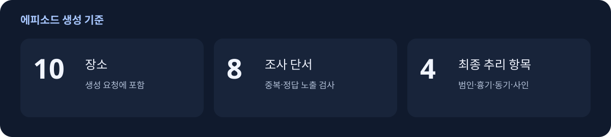
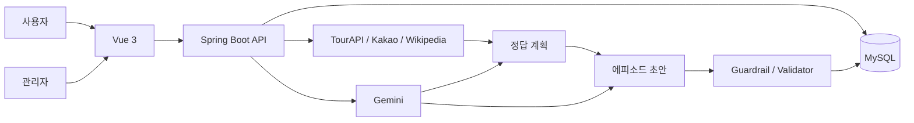

# Operation KOREA

장소 데이터를 바탕으로 사건 초안을 만들고, 검증과 저장으로 연결하는 백엔드를 맡았습니다.

Operation KOREA는 장소를 찾아가 퍼즐을 풀고, 모은 단서로 범인·동기·흉기·사인을 추리하는 야외 방탈출 서비스입니다. 2명이 개발했고, 저는 Spring Boot API와 외부 API 연동, AI 생성 흐름을 담당했습니다.

> 🏆 **SSAFY 15기 1학기 관통 프로젝트 우수상 **

<p>
  
  
  
  
  
  
  
  
</p>


## 프로젝트 요약

| 기간 | 구성 | 담당 | 결과물 |
| --- | --- | --- | --- |
| 2026.04 ~ 2026.06 | 2인 팀 | 백엔드, 외부 API, AI 생성 파이프라인, DB 초기 구성 | 사용자·관리자 웹, 에피소드 생성 도구 |



## 맡은 일

- Spring Boot와 MyBatis로 인증, 에피소드, 추리, 관리자 API 구현
- MySQL 초기 스키마와 백엔드 연결 구성
- TourAPI, Kakao Local, Wikipedia 장소 데이터 연동
- Gemini를 이용한 정답 계획과 에피소드 초안 생성
- AI 결과의 정답 노출, 구조 누락, 중복, 한글 깨짐 검사
- 진행 조건에 따른 지도 응답과 최종 장소 공개 처리
- 미니게임 제출값 검사와 서버의 오답 횟수 관리

DB는 초기 구조와 연결까지만 맡았고, 이후 테이블 확장과 데이터 작업은 팀원 홍성혁이 담당했습니다.

## 구조와 기술 선택



| 기술 | 사용한 이유 |
| --- | --- |
| Spring Boot 4 | 인증, 게임 진행, 관리자 기능을 REST API로 분리 |
| MyBatis + MySQL | 진행 상태와 단서 데이터를 SQL로 조회·저장 |
| TourAPI + Kakao Local | 실제 장소 후보와 좌표 수집 |
| Wikipedia | 장소의 역사·문화 설명 보강 |
| Gemini | 정답 계획과 사건 초안을 나눠 생성 |
| OpenAI | 기존 관광 미션 생성과 사진 판정 기능에 연동 |
| JUnit | 정답 노출, 필드 누락 등 검사 조건 확인 |

## 문제 해결

### 1. 생성된 사건의 정답과 단서가 맞는지 검사했습니다

AI가 응답을 반환해도 게임에 바로 쓸 수는 없었습니다. 범인이 용의자 목록에 없거나 단서가 정답을 그대로 말하는 경우가 있어, 프롬프트 조정과 함께 Java 검사 로직을 추가했습니다.

먼저 범인·흉기·동기·사인을 정한 뒤, 이를 사건 초안 생성에 전달했습니다. 생성 후에는 용의자와 범인의 일치 여부, 단서 개수, 정답 노출과 중복을 검사하고 보정 결과를 다시 확인하도록 구성했습니다.

```text
장소 후보 → 장소 정보 → 정답 계획 → 초안 → 보정 → 검증 → 저장
```

검사 결과는 초안 응답의 경고와 공개 가능 여부에 반영했습니다. 저장 API에서도 필수 정답과 장소, 문장 형식을 확인하며, 초안은 바로 공개하지 않고 `DRAFT` 상태로 저장합니다. 테스트에는 범인 누락, 정답 노출, 한글 깨짐 등의 입력을 넣어 검사 결과를 확인하는 사례를 남겼습니다. 이야기의 개연성은 별도로 검수해야 합니다.

### 2. 장소 설명과 사건 생성에 넣을 정보를 나눴습니다

장소 정보는 사건의 배경으로 쓸 수 있지만, 장소 이름이 단서에 들어가면 최종 목적지를 드러낼 수 있었습니다. 그래서 장소 데이터 중 어떤 내용을 어느 생성 단계에 넣을지 나눴습니다.

TourAPI와 Wikipedia로 설명을 보강하고, 정답 계획에는 장소의 역사·문화 배경을 추려 넣었습니다. 사건 초안에는 승인한 정답을 전달하되 장소명·주소·현장 검수 메모가 그대로 섞이지 않도록 입력을 제한했습니다.

장소명이 사건 문장에 남는 경우에는 후처리하고, 프롬프트에 제외한 정보가 다시 들어가지 않는지 테스트로 확인했습니다. 생성 실패율이나 재호출 감소량은 측정하지 않았습니다.

### 3. 장소 공개와 미니게임 제출 처리를 서버에 두었습니다

최종 장소는 조사 진행 조건을 만족한 뒤 지도에 표시하도록 했습니다. 서버가 진행 상태를 조회하고, 공개 전에는 최종 장소를 사용자 지도 응답 목록에서 제외합니다.

미니게임은 클라이언트가 보낸 `MG|TYPE|VALUE` 형식의 제출값을 유형별로 검사하고, 오답 횟수와 재시도 상태를 서버에서 관리했습니다. 다만 일부 게임은 클라이언트의 완료 표시와 점수를 검사하므로, 실제 플레이 여부를 확인하는 검증은 남아 있습니다.

## 코드에서 확인할 부분

- [AI 생성 단계 조율](backend/src/main/java/com/operation/seoul/admin/episode/service/AdminEpisodeGeminiService.java)
- [정답 계획 생성](backend/src/main/java/com/operation/seoul/admin/episode/service/GeminiAnswerPlanGenerator.java)
- [에피소드 초안 생성](backend/src/main/java/com/operation/seoul/admin/episode/service/GeminiDraftGenerator.java)
- [장소 정보 보강](backend/src/main/java/com/operation/seoul/admin/episode/service/ExternalPlaceResearchService.java)
- [생성 결과 보정](backend/src/main/java/com/operation/seoul/admin/episode/service/DraftCrimeMysteryGuardrailApplier.java)
- [초안 검증](backend/src/main/java/com/operation/seoul/admin/episode/service/AiEpisodeDraftValidator.java)
- [미니게임 서버 검증](backend/src/main/java/com/operation/seoul/episode/service/MinigameProofValidator.java)
- [AI 생성 회귀 테스트](backend/src/test/java/com/operation/seoul/admin/episode/service/AdminEpisodeGeminiServiceTest.java)

## 주요 화면


## 남은 과제

- GPS와 Tmap을 모바일 실기기와 실제 장소에서 검증
- AI 호출별 토큰과 비용 측정
- 초기 관광 미션 호환 코드를 현재 에피소드 구조로 통합
- 제휴 쿠폰 지급 기능 연결
