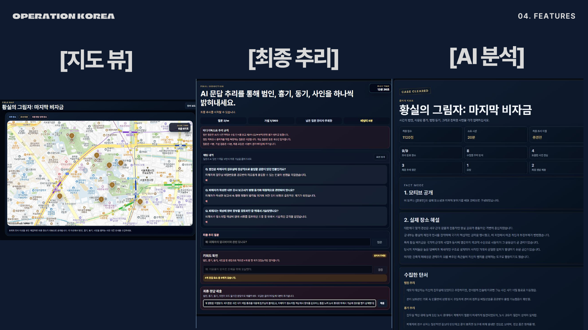
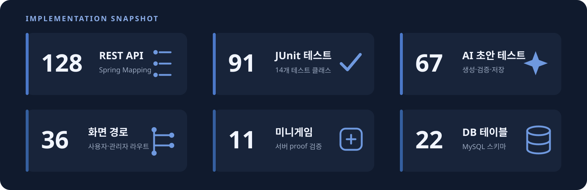
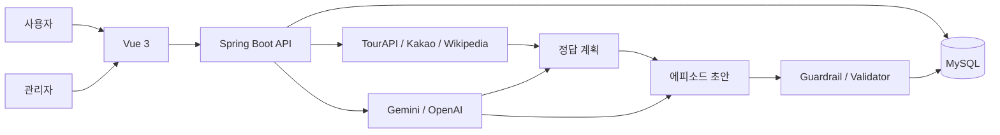
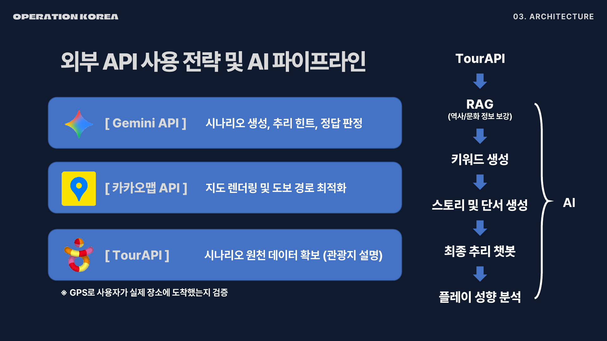
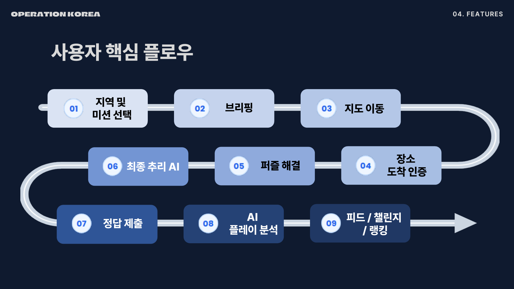
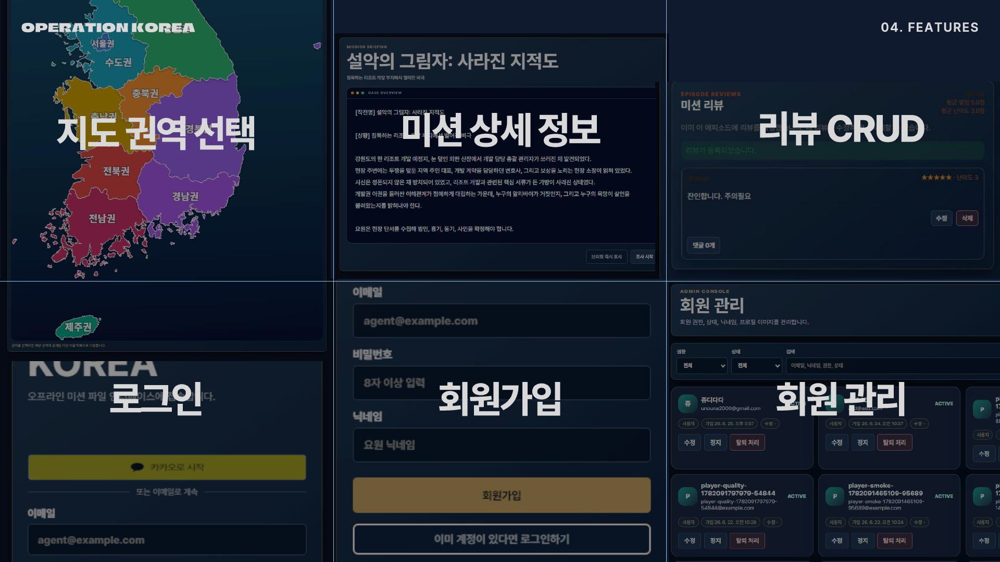

# Operation KOREA

TourAPI와 LLM을 이용해 실제 장소를 사건 현장으로 바꾸는 야외 방탈출 서비스입니다. 사용자는 지도에 표시된 장소를 찾아가 퍼즐을 풀고, 모은 단서로 범인과 동기, 흉기, 사인을 추리합니다.

> 🏆 **SSAFY 15기 1학기 관통 프로젝트 우수상 · 서울 16반 2등**

<p>
  
  
  
  
  
  
  
  
</p>



## 프로젝트 요약

| 기간 | 구성 | 담당 | 결과물 |
| --- | --- | --- | --- |
| 2026.04 ~ 2026.06 | 2인 팀 | 백엔드, 외부 API, AI 생성 파이프라인, DB 초기 구성 | 사용자·관리자 웹, 에피소드 생성 도구 |

저는 프로젝트 구조와 백엔드 API를 설계하고, 장소 데이터 수집부터 AI 초안 검증과 저장까지 이어지는 흐름을 구현했습니다.



수치는 현재 저장소의 매핑 애너테이션, `@Test`, 라우터, 컴포넌트, 스키마를 기준으로 집계했습니다.

## 맡은 일

- Spring Boot와 MyBatis로 인증, 에피소드, 추리, 관리자 API 구현
- MySQL 초기 스키마와 백엔드 연결 구성
- TourAPI, Kakao Local, Wikipedia 장소 데이터 연동
- Gemini/OpenAI 정답 계획과 에피소드 초안 생성 흐름 구현
- AI 결과의 정답 노출, 구조 누락, 중복, 한글 깨짐 검사
- 지도 응답의 최종 장소 비공개 처리
- 11개 미니게임 proof와 오답 횟수 서버 검증

DB는 초기 구조와 연결까지만 맡았습니다. 이후 테이블 확장과 데이터 작업은 홍성혁이 담당했습니다.

## 구조와 기술 선택



| 기술 | 사용한 이유 |
| --- | --- |
| Spring Boot 4 | 인증, 게임 진행, 관리자 기능을 REST API로 분리 |
| MyBatis + MySQL | 진행 상태와 단서 관계를 SQL로 확인하고 제어 |
| TourAPI + Kakao Local | 실제 장소 후보와 좌표 수집 |
| Wikipedia | 장소의 역사·문화 정보를 생성 입력과 분리해 보강 |
| Gemini + OpenAI | 정답 계획, 사건 초안, 최종 추리 응답 생성 |
| JUnit | 정답 노출과 생성 구조 오류를 회귀 테스트로 고정 |

## 문제 해결

### 1. AI가 JSON을 반환해도 저장할 수 없는 문제

**문제.** 한 번의 요청으로 장소 설명, 정답, 단서, 스토리를 만들자 범인이 용의자 목록에 없거나 정답이 단서에 노출됐습니다. 같은 용의자와 증거가 반복되고 일부 필드가 빠지는 경우도 있었습니다.

**판단.** 프롬프트만 고쳐서는 같은 문제가 다시 생깁니다. 생성 결과를 신뢰하지 않고 서비스 규칙으로 검사해야 했습니다.

**구현.** 장소 후보 조회, 장소 정보 보강, 정답 계획, 초안 생성, 규칙 기반 보정, 검증, 저장을 분리했습니다. 정답 계획을 계약으로 두고 다음 단계가 이 값을 벗어나지 못하게 했습니다.

```text
장소 후보 → 장소 정보 → 정답 계획 → 초안 → 보정 → 검증 → 저장
```

**결과.** 범인·용의자 관계, 정답 노출, 단서 개수, 중복, 한글 깨짐을 67개 AI 초안 테스트로 확인합니다. 검사를 통과하지 못한 초안은 저장하지 않습니다.



### 2. RAG 데이터가 스토리와 정답을 오염시키는 문제

**문제.** 실제 장소 설명을 프롬프트에 그대로 넣자 장소명이 사건 문장에 반복되고, 최종 장소와 정답을 예상할 수 있는 문구가 생겼습니다. 생성 범위가 커지면서 실패 시 전체 초안을 다시 만들어야 했습니다.

**판단.** 외부 데이터는 수집 목적에 따라 분리하고, 형식 오류는 모델이 아니라 코드가 처리해야 했습니다.

**구현.** TourAPI와 Wikipedia 결과는 장소 설명 단계에서만 사용했습니다. 정답 계획과 스토리 생성을 나누고, 금칙어·중복·필드 누락은 Java validator와 normalizer로 검사했습니다. 실제 장소 정보가 스토리 프롬프트에 들어가지 않는지도 테스트했습니다.

**결과.** 어느 단계에서 입력이 섞였는지 확인할 수 있게 됐고, 구조 오류 때문에 전체 생성을 다시 요청하는 경우를 줄였습니다.

### 3. 클라이언트가 게임 진행을 바꿀 수 있는 문제

**문제.** 지도 API가 내부 장소 구분값을 내려주면 네트워크 응답만 보고 최종 장소를 알 수 있습니다. 미니게임도 프런트가 성공 여부만 보내면 요청을 바꿔 통과할 수 있습니다.

**판단.** 숨겨야 하는 값과 성공 판정은 클라이언트에 두지 않았습니다.

**구현.** 사용자 지도 응답에는 `publicMarkerType`만 포함하고, `is_final_place`는 서버의 도착 판정에만 사용했습니다. 미니게임은 `MG|TYPE|VALUE` proof를 서버에서 다시 계산하고, 오답 횟수와 제한 시간은 DB에 기록했습니다.

**결과.** 최종 장소는 진행 조건을 만족한 뒤 서버가 공개합니다. 11개 미니게임은 같은 검증 인터페이스를 사용합니다.

## 코드에서 확인할 부분

- [AI 생성 단계 조율](backend/src/main/java/com/operation/seoul/admin/episode/service/AdminEpisodeGeminiService.java)
- [정답 계획 생성](backend/src/main/java/com/operation/seoul/admin/episode/service/GeminiAnswerPlanGenerator.java)
- [에피소드 초안 생성](backend/src/main/java/com/operation/seoul/admin/episode/service/GeminiDraftGenerator.java)
- [장소 정보 보강](backend/src/main/java/com/operation/seoul/admin/episode/service/ExternalPlaceResearchService.java)
- [생성 결과 보정](backend/src/main/java/com/operation/seoul/admin/episode/service/DraftCrimeMysteryGuardrailApplier.java)
- [초안 검증](backend/src/main/java/com/operation/seoul/admin/episode/service/AiEpisodeDraftValidator.java)
- [미니게임 서버 검증](backend/src/main/java/com/operation/seoul/episode/service/MinigameProofValidator.java)
- [AI 생성 회귀 테스트](backend/src/test/java/com/operation/seoul/admin/episode/service/AdminEpisodeGeminiServiceTest.java)

## 주요 화면





## 남은 과제

- GPS와 Tmap을 모바일 실기기와 실제 장소에서 검증
- AI 호출별 토큰과 비용 측정
- 초기 관광 미션 호환 코드를 현재 에피소드 구조로 통합
- 제휴 쿠폰 지급 기능 연결
