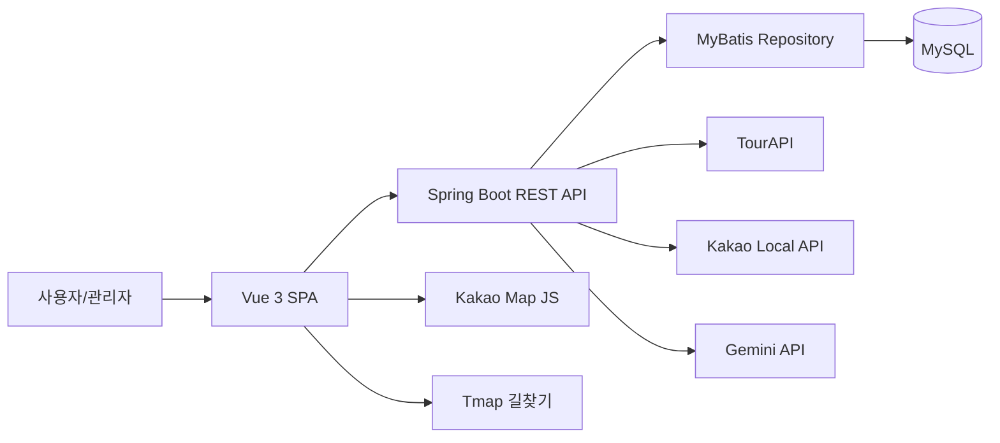
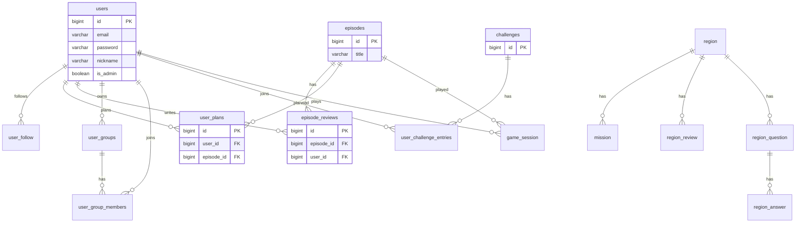

# 설계 문서

작성일: 2026-06-25

## 1. 시스템 개요

Operation KOREA는 Spring Boot REST API 서버와 Vue.js SPA를 연동한 장소 기반 미션 서비스다. DB는 MySQL을 기준으로 하고, 백엔드 영속성 계층은 MyBatis를 사용한다.

## 2. 아키텍처

## 3. Use-Case Diagram

```mermaid
flowchart TB
  Guest[비회원]
  User[일반 사용자]
  Admin[관리자]

  Guest --> UC1[회원가입]
  Guest --> UC2[로그인]
  User --> UC3[권역 선택]
  User --> UC4[에피소드 목록/상세 조회]
  User --> UC5[미션 시작/지도 확인]
  User --> UC6[장소 도착 판정]
  User --> UC7[퍼즐 풀이]
  User --> UC8[단서/증거/용의자 확인]
  User --> UC9[최종 추리/정답 제출]
  User --> UC10[리뷰 작성/수정/삭제]
  User --> UC11[찜/관심 목록 관리]
  User --> UC12[팔로우/일정/그룹/챌린지]
  User --> UC13[추천/코칭 확인]

  Admin --> UC14[회원 관리]
  Admin --> UC15[리뷰 관리]
  Admin --> UC16[장소 후보 조회]
  Admin --> UC17[AI 초안 생성]
  Admin --> UC18[에피소드 등록/수정/공개]
```

## 4. ER Diagram

## 5. 주요 도메인 설계

| 도메인 | 책임 | 주요 파일 |
| --- | --- | --- |
| Auth/User | 로그인, JWT, 내 정보, 관리자 회원 관리 | `auth`, `user` package |
| Episode | 공개 에피소드 조회, 플레이, 지도, 퍼즐, 최종 추리 | `episode` package |
| Admin Episode | 에피소드 생성/검수/공개, AI 초안 | `admin/episode` package |
| Review | 에피소드 리뷰, 관리자 리뷰 관리 | `review` package |
| Community | 권역 리뷰/Q&A/답변 | `community` package |
| Favorite/Follow/Plan | 찜, 팔로우, 일정 관리 | `favorite`, `user`, `plan` |
| Challenge/Ranking/Coaching | 챌린지, 랭킹, 추천/코칭 | `challenge`, `ranking`, `recommendation`, `coaching` |

## 6. 보안 설계

- JWT 기반 인증.
- 관리자 라우트는 프론트 router meta와 백엔드 권한 검사로 분리.
- 비활성/삭제 사용자는 로그인과 보호 API 접근 제한.
- 사용자 지도 응답에는 실제 최종 장소 내부 필드를 노출하지 않는다.

## 7. API 설계 원칙

- `/api/v1` prefix 사용.
- 사용자 기능과 관리자 기능 분리.
- 목록 API는 query param 기반 필터링.
- 프론트 API 클라이언트는 `frontend/src/api`에 기능별 모듈로 분리.
