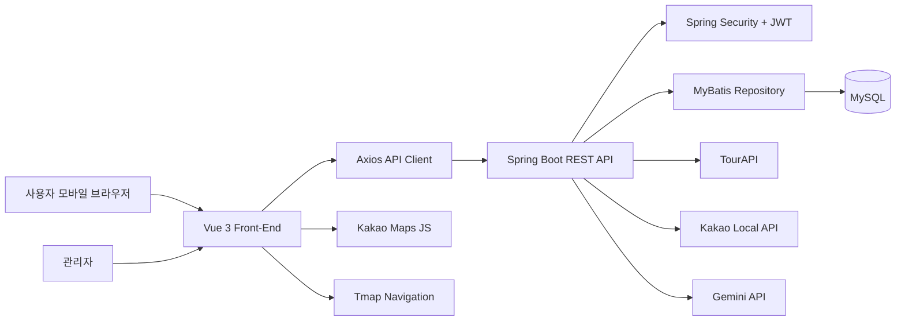
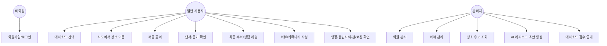
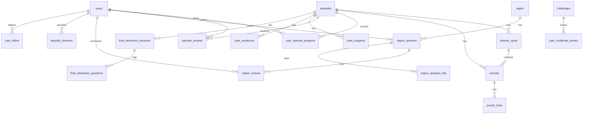

# 설계 문서

## 1. 시스템 아키텍처

## 2. 백엔드 설계

| 계층 | 역할 | 대표 패키지 |
| --- | --- | --- |
| Controller | REST API 요청/응답 처리 | `auth`, `episode`, `community`, `admin` |
| Service | 비즈니스 규칙, 검증, 상태 전이 | `EpisodePlayService`, `AdminEpisodeService` |
| Repository | MyBatis SQL 접근 | `*Repository` |
| Domain | DB 엔티티 형태 객체 | `domain` |
| DTO | API 요청/응답 모델 | `dto` |
| Config | 보안, 마이그레이션, 필터 | `global.config` |

## 3. 프론트엔드 설계

| 영역 | 역할 |
| --- | --- |
| `views` | 라우트 단위 화면 |
| `components` | 재사용 UI와 미니게임 |
| `api` | Axios 기반 API 래퍼 |
| `stores` | Pinia 세션 상태 |
| `router` | 인증/관리자 접근 제어 |
| `constants` | 권역 지도/메타 데이터 |

## 4. Use-Case Diagram

## 5. ER Diagram

## 6. 핵심 설계 결정

- 사용자 지도 API에는 `is_final_place`를 노출하지 않고 `publicMarkerType`만 제공한다.
- 퍼즐 보상은 `reward_payload` JSON으로 단서/증거/용의자 해금을 유연하게 처리한다.
- 관리자 AI 생성 결과는 즉시 공개하지 않고 DRAFT 저장, 검증, publish readiness를 거친다.
- 외부 API 키는 properties 파일에 직접 저장하지 않고 환경변수로 주입한다.
- 커뮤니티 권역은 기본 seed를 보장해 비어 있는 DB에서도 게시글 작성이 가능하게 한다.

