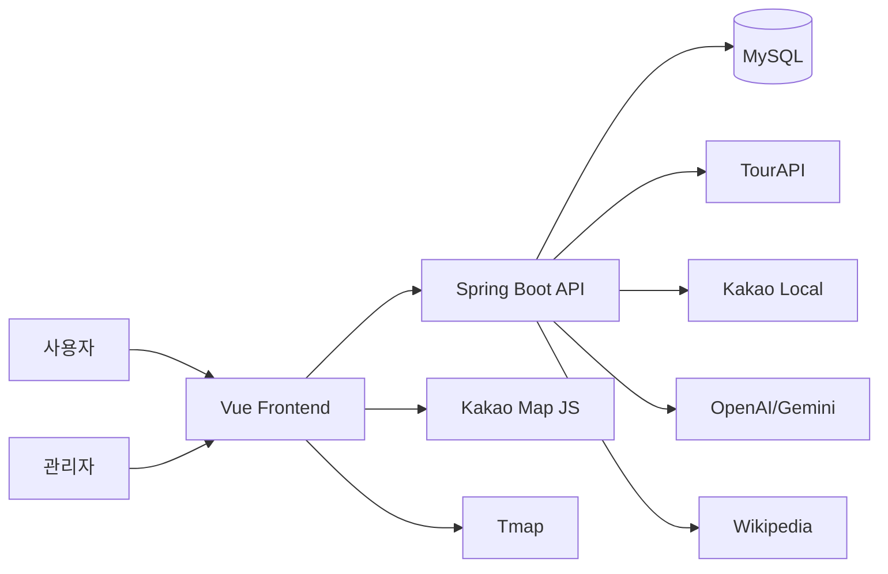
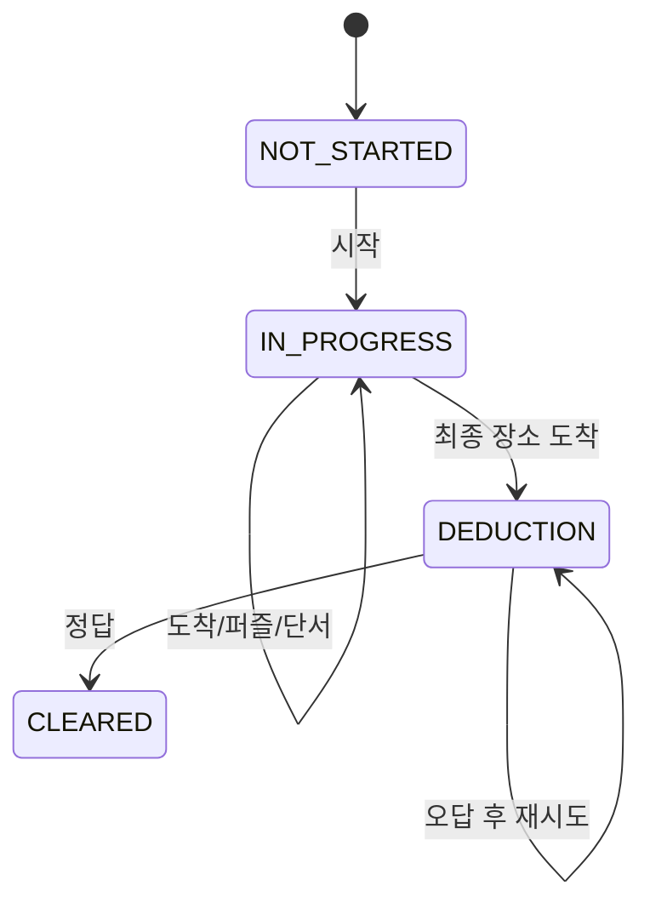
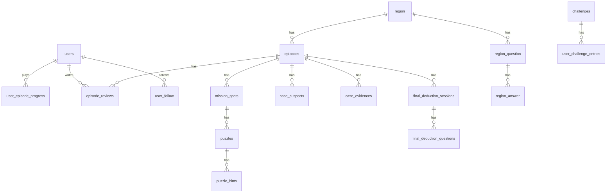

# 설계 정리

## 1. 전체 구조

## 2. 백엔드 패키지

| 패키지 | 맡은 부분 |
| --- | --- |
| `auth` | 로그인, OAuth, JWT |
| `user` | 내 정보, 회원 관리, 피드, 팔로우 |
| `location` | 권역, 기존 미션 위치 기능 |
| `episode` | 에피소드 플레이, 지도, 퍼즐, 추리 |
| `casefile` | 사건 파일 조회 |
| `review` | 리뷰와 댓글 |
| `community` | 지역 리뷰/Q&A |
| `favorite` | 관심 에피소드 |
| `ranking`, `challenge`, `recommendation`, `coaching` | 부가 기능 |
| `admin.episode` | 관리자 에피소드 관리와 AI 초안 |
| `game` | 예전 관광 미션 호환 기능 |
| `global` | 설정, 예외, 보안, 마이그레이션 |

## 3. 프론트 구조

| 위치 | 내용 |
| --- | --- |
| `src/router/index.js` | 라우트와 로그인/관리자 가드 |
| `src/stores/sessionStore.js` | 토큰과 현재 사용자 관리 |
| `src/api` | 기능별 API 호출 |
| `src/views` | 화면 단위 컴포넌트 |
| `src/components/episode` | 에피소드 플레이 컴포넌트 |
| `src/components/episode/minigames` | 미니게임 |

## 4. 플레이 상태

## 5. 데이터 관계

## 6. 보안 쪽에서 신경 쓴 점

- JWT가 있어도 inactive, suspended, deleted 사용자는 막는다.
- 관리자 화면과 관리자 API는 `ROLE_ADMIN`만 접근하게 한다.
- 사용자 지도 응답에는 최종 장소 내부 값을 넣지 않는다.
- 미니게임 proof는 서버에서 다시 검증한다.
- 운영 secret은 환경변수로 받는다.
