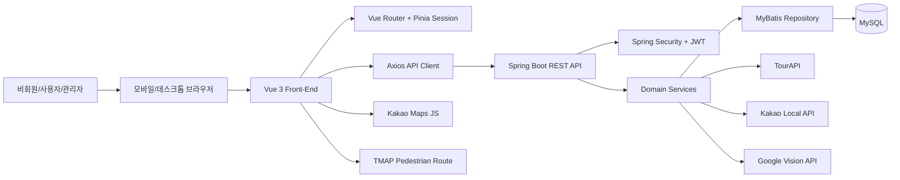
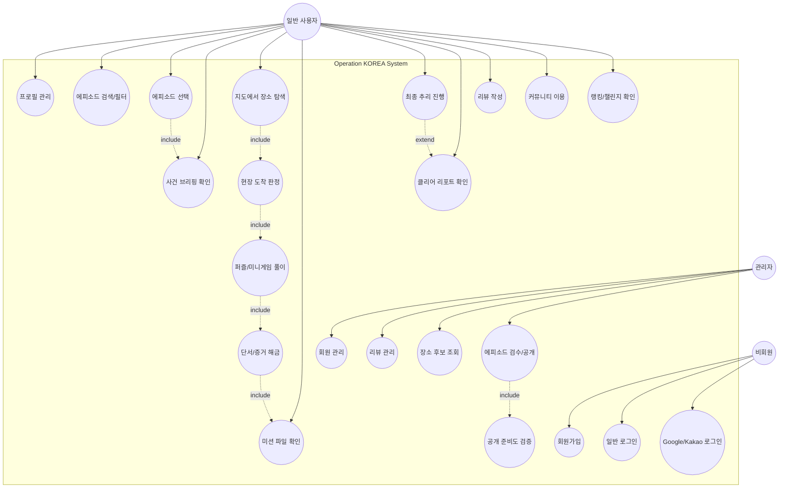
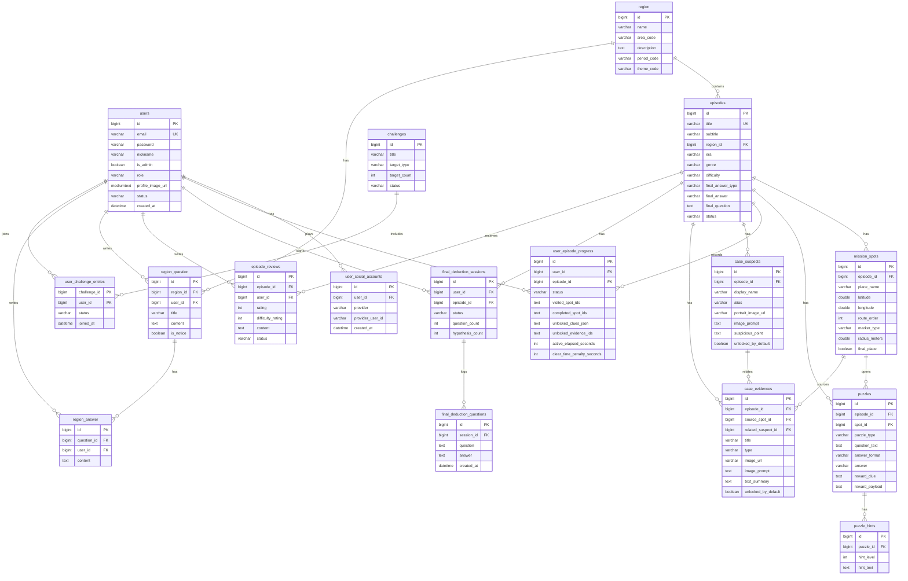
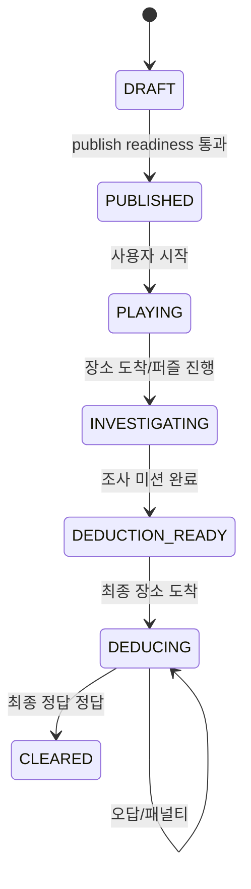

# 설계 문서

## 1. 시스템 아키텍처

## 2. 백엔드 구조

| 계층 | 역할 | 대표 구성 |
| --- | --- | --- |
| Controller | REST API 엔드포인트, 인증 사용자 주입 | `AuthController`, `EpisodePlayController`, `AdminEpisodeController` |
| Service | 비즈니스 규칙, 상태 전이, 외부 API 연동 | `EpisodePlayService`, `AdminEpisodeService`, `OAuthService` |
| Repository | MyBatis SQL 접근 | `*Repository` |
| Domain | DB 테이블과 매핑되는 객체 | `Episode`, `CaseEvidence`, `User` |
| DTO | 요청/응답 모델 | `*Request`, `*Response` |
| Config | 보안, CORS, 마이그레이션, 운영 검증 | `SecurityConfig`, `EpisodeSchemaMigration` |

## 3. 프론트엔드 구조

| 영역 | 역할 | 대표 파일 |
| --- | --- | --- |
| `views` | 라우트 단위 화면 | `EpisodeMapView.vue`, `AdminEpisodesView.vue` |
| `components` | 재사용 UI | `PuzzleCard.vue`, `CaseFileTabMenu.vue` |
| `components/episode/minigames` | 미니게임 UI | `MemoryCardGame.vue`, `ColorStroopMiniGame.vue` |
| `api` | Axios API 래퍼 | `episodeApi.js`, `adminEpisodeApi.js` |
| `stores` | 세션 상태 | `sessionStore.js` |
| `router` | 인증/관리자 라우팅 | `router/index.js` |
| `styles` | 공통 디자인 시스템 | `operation-korea-design-system.css` |

## 4. Use-Case Diagram

## 5. Use-Case 명세

| Use Case | Actor | 선행 조건 | 기본 흐름 | 예외/대안 |
| --- | --- | --- | --- | --- |
| 로그인 | 비회원 | 계정 또는 OAuth 계정 존재 | 인증 정보 입력 → JWT 발급 → 권역 지도 이동 | 비활성/오류 계정은 실패 메시지 |
| 에피소드 플레이 | 사용자 | 로그인, 공개 에피소드 존재 | 목록 선택 → 브리핑 → 지도 → 도착 → 퍼즐 → 단서 해금 | GPS 실패 시 개발 모드 또는 오류 안내 |
| 최종 추리 | 사용자 | 조사 미션 완료 | 최종 장소 도착 → 질문/가설 → 최종 정답 제출 | 오답 시 시간 패널티 |
| 에피소드 공개 | 관리자 | DRAFT 존재 | publish readiness 확인 → 공개 전환 | 필수 단서/증거 누락 시 차단 |

## 6. 상세 ER Diagram

## 7. 핵심 상태 전이

## 8. 핵심 설계 결정

- 사용자 지도 API에는 실제 최종 장소 여부를 직접 노출하지 않고 `publicMarkerType`만 제공한다.
- 퍼즐 보상은 `reward_payload` JSON으로 단서, 증거, 용의자 해금을 유연하게 처리한다.
- OAuth와 외부 API 키는 운영 환경에서 환경변수로 주입한다.
- 화면은 모바일 우선으로 설계하고, 지도·팝업·미니게임 상호작용을 중심으로 구성한다.
