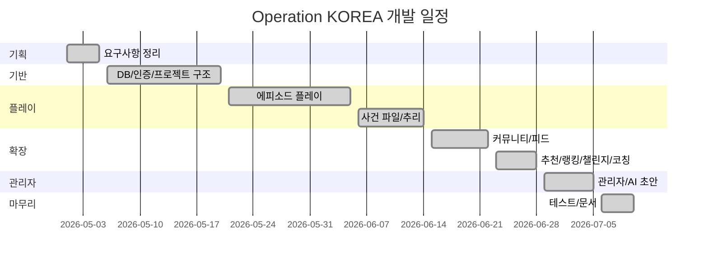

# WBS / 일정

## 1. 작업 정리

| 구분 | 작업 | 기간 | 상태 |
| --- | --- | --- | --- |
| 1 | 기획, 요구사항 정리 | 2026-05-01 ~ 2026-05-05 | 완료 |
| 2 | 프로젝트 기본 구조, DB, 인증 | 2026-05-06 ~ 2026-05-20 | 완료 |
| 3 | 에피소드 목록, 지도, 도착, 퍼즐 | 2026-05-21 ~ 2026-06-05 | 완료 |
| 4 | 사건 파일, 단서, 최종 추리 | 2026-06-06 ~ 2026-06-14 | 완료 |
| 5 | 리뷰, 커뮤니티, 피드, 팔로우 | 2026-06-15 ~ 2026-06-22 | 완료 |
| 6 | 추천, 랭킹, 챌린지, 코칭 | 2026-06-23 ~ 2026-06-28 | 완료 |
| 7 | 관리자 기능과 AI 초안 | 2026-06-29 ~ 2026-07-05 | 완료 |
| 8 | 테스트, 문서 정리 | 2026-07-06 ~ 2026-07-10 | 완료 |

## 2. Gantt

## 3. 리스크

| 리스크 | 처리 |
| --- | --- |
| 외부 API 키 누락 | 설정명과 에러를 분리해서 확인 가능하게 함 |
| AI 초안 품질 편차 | 검증 로직과 guardrail 추가 |
| 최종 장소 노출 | DTO와 프론트 사용 필드 제한 |
| 실제 장소 정보 변경 | 운영 전 현장 검수 필요 |
