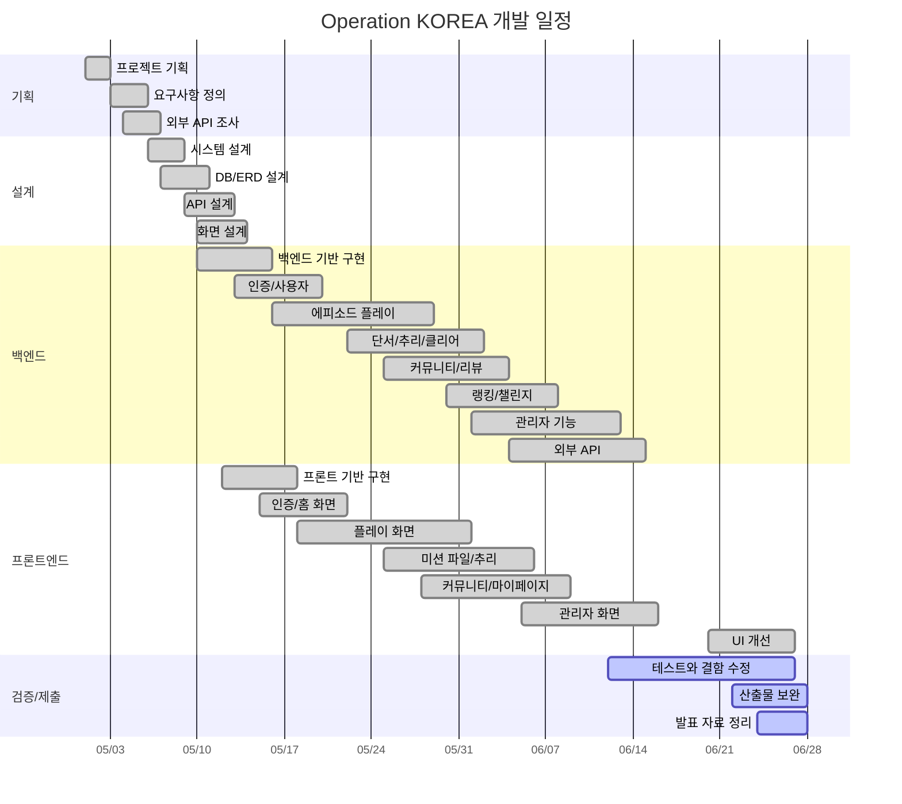

# WBS 및 Gantt Chart

## 1. WBS

| WBS | 작업 | 세부 내용 | 담당 | 산출물 | 시작 | 종료 | 상태 |
| --- | --- | --- | --- | --- | --- | --- | --- |
| 1.0 | 프로젝트 기획 | 문제 정의, 목표, 범위 확정 | PM/기획 | 프로젝트 개요 | 2026-05-01 | 2026-05-02 | 완료 |
| 1.1 | 요구사항 정의 | 사용자/관리자 기능, 비기능, 수용 기준 작성 | PM/기획 | 요구사항 정의서 | 2026-05-03 | 2026-05-05 | 완료 |
| 1.2 | 외부 API 조사 | Kakao, Google, TourAPI, TMAP 검토 | Backend | API 연동 계획 | 2026-05-04 | 2026-05-06 | 완료 |
| 2.0 | 시스템 설계 | 아키텍처, 계층 구조, 인증 구조 설계 | Backend | 설계 문서 | 2026-05-06 | 2026-05-08 | 완료 |
| 2.1 | DB 설계 | 사용자, 에피소드, 장소, 퍼즐, 사건 파일 ERD | Backend | ER Diagram, schema | 2026-05-07 | 2026-05-10 | 완료 |
| 2.2 | API 설계 | 사용자/관리자 REST API, DTO, 오류 정책 | Backend | API 목록 | 2026-05-09 | 2026-05-12 | 완료 |
| 2.3 | 화면 설계 | 라우트, 화면 흐름, 와이어프레임 | Frontend | 화면 설계서 | 2026-05-10 | 2026-05-13 | 완료 |
| 3.0 | 백엔드 기반 구현 | Spring Boot, MyBatis, 보안, 공통 응답 | Backend | 백엔드 기본 구조 | 2026-05-10 | 2026-05-15 | 완료 |
| 3.1 | 인증/사용자 | 일반 로그인, OAuth, 프로필, 팔로우 | Backend | 인증/사용자 API | 2026-05-13 | 2026-05-19 | 완료 |
| 3.2 | 에피소드 플레이 | 목록, 상세, 브리핑, 지도, 도착, 퍼즐 | Backend | 플레이 API | 2026-05-16 | 2026-05-28 | 완료 |
| 3.3 | 단서/추리 | 보상 처리, 사건 파일, 최종 추리, 클리어 | Backend | 추리/클리어 API | 2026-05-22 | 2026-06-01 | 완료 |
| 3.4 | 커뮤니티/리뷰 | 게시글, 댓글, 좋아요, 리뷰 | Backend | 커뮤니티 API | 2026-05-25 | 2026-06-03 | 완료 |
| 3.5 | 랭킹/챌린지 | 후속 활동과 분석 API | Backend | 부가 기능 API | 2026-05-30 | 2026-06-07 | 완료 |
| 3.6 | 관리자 기능 | 회원, 리뷰, 에피소드, 공개 준비도 | Backend | 관리자 API | 2026-06-01 | 2026-06-12 | 완료 |
| 3.7 | 외부 API | 장소 후보, Vision/TMAP 연동 | Backend | 외부 연동 모듈 | 2026-06-04 | 2026-06-14 | 완료 |
| 4.0 | 프론트 기반 구현 | Vue, Router, Pinia, Axios, 디자인 시스템 | Frontend | 프론트 기본 구조 | 2026-05-12 | 2026-05-17 | 완료 |
| 4.1 | 인증/홈 화면 | 인트로, OAuth callback, 권역 지도 | Frontend | 인증/홈 UI | 2026-05-15 | 2026-05-21 | 완료 |
| 4.2 | 플레이 화면 | 목록, 상세, 브리핑, 지도, 퍼즐 팝업 | Frontend | 플레이 UI | 2026-05-18 | 2026-05-31 | 완료 |
| 4.3 | 미션 파일/추리 | 단서, 증거, 용의자, 최종 추리 화면 | Frontend | 사건 파일 UI | 2026-05-25 | 2026-06-05 | 완료 |
| 4.4 | 커뮤니티/마이페이지 | 게시글, 리뷰, 프로필, 피드, 관심 목록 | Frontend | 커뮤니티 UI | 2026-05-28 | 2026-06-08 | 완료 |
| 4.5 | 관리자 화면 | 에피소드 검증, 회원/리뷰 관리 | Frontend | 관리자 UI | 2026-06-05 | 2026-06-15 | 완료 |
| 4.6 | UI 개선 | 버튼 색상, 가독성, 미니게임 상호작용 개선 | Frontend | UI 개선 내역 | 2026-06-20 | 2026-06-26 | 완료 |
| 5.0 | 테스트 | 단위 테스트, 빌드, 스모크 테스트 | QA | 테스트 결과 | 2026-06-12 | 2026-06-22 | 진행 |
| 5.1 | 결함 수정 | 로그인, 미션 팝업, UI 결함 수정 | FE/BE | 수정 커밋 | 2026-06-18 | 2026-06-26 | 진행 |
| 6.0 | 문서/제출 | 요구사항, 설계, WBS, Gantt, 화면 설계 보완 | 문서/QA | 최종 산출물 | 2026-06-22 | 2026-06-27 | 진행 |
| 6.1 | 발표 자료 | 최종 보고서, 발표 자료, PPT/PDF | 문서/QA | 발표 자료 | 2026-06-24 | 2026-06-27 | 진행 |

## 2. Gantt Chart

## 3. 마일스톤

| 마일스톤 | 기준일 | 완료 기준 | 상태 |
| --- | --- | --- | --- |
| M1. 요구사항 확정 | 2026-05-05 | 주요 기능/비기능 요구사항 정의 | 완료 |
| M2. 설계 확정 | 2026-05-13 | 아키텍처, ERD, 화면 흐름 확정 | 완료 |
| M3. 플레이 MVP | 2026-05-31 | 에피소드 선택부터 퍼즐 풀이까지 가능 | 완료 |
| M4. 추리/커뮤니티 완성 | 2026-06-08 | 최종 추리, 리뷰, 커뮤니티 가능 | 완료 |
| M5. 관리자 기능 완성 | 2026-06-15 | 공개 준비도, 관리자 기능 가능 | 완료 |
| M6. 최종 제출 | 2026-06-27 | 문서, 발표, 빌드 검증 정리 | 진행 |

## 4. 역할 분담

| 역할 | 담당 범위 |
| --- | --- |
| PM/기획 | 요구사항, 일정, 범위 조정, 발표 구성 |
| Backend | API, DB, 보안, 상태 전이, 외부 API 연동 |
| Frontend | Vue 화면, 라우팅, 상태 관리, 모바일 UI, 미니게임 |
| QA/문서 | 테스트, 결함 정리, 산출물, 최종 보고서 |

## 5. 리스크 및 대응

| 리스크 | 영향 | 대응 |
| --- | --- | --- |
| 외부 API 키/도메인 설정 오류 | 로그인, 지도, 장소 조회 실패 | local/prod 설정 분리, 오류 메시지 표시 |
| GPS 정확도 문제 | 현장 도착 판정 실패 | 개발 모드, 반경 설정, 명확한 실패 안내 |
| 모바일 화면 가독성 | 플레이 이탈 | 버튼 색상/대비/상태 표시 개선 |
| 일정 압박 | 문서 품질 저하 | 최종 산출물 목차와 문서별 보완 진행 |
