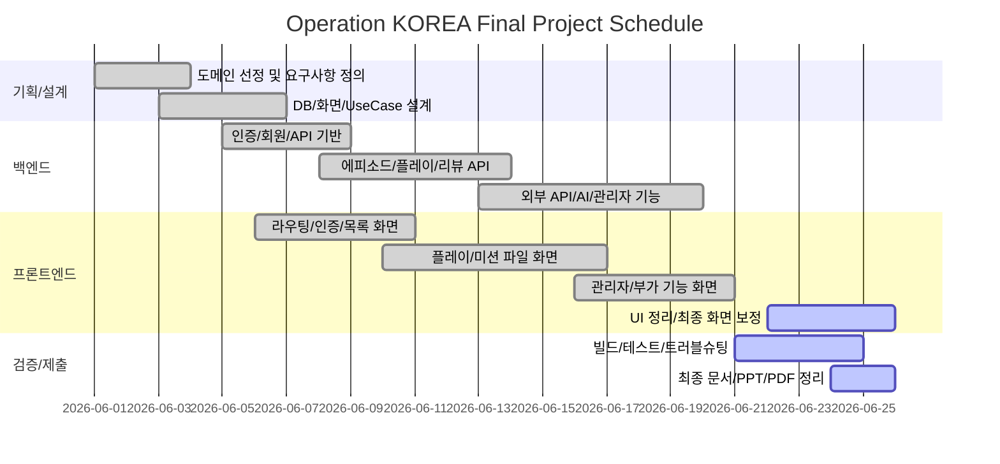

# WBS 및 Gantt Chart

작성일: 2026-06-25

## 1. WBS

| ID | 작업 | 담당 역할 | 산출물 | 상태 |
| --- | --- | --- | --- | --- |
| 1.0 | 프로젝트 기획 | 팀 공통 | 도메인 정의, 핵심 시나리오 | 완료 |
| 1.1 | 요구사항 정의 | 기획/백엔드/프론트 | 요구사항 정의서 | 완료 |
| 1.2 | 기술 스택 확정 | 팀 공통 | Spring Boot, MyBatis, Vue3, MySQL | 완료 |
| 2.0 | DB 설계 | 백엔드 | `schema.sql`, ERD | 완료 |
| 2.1 | 회원/인증 스키마 | 백엔드 | users, JWT | 완료 |
| 2.2 | 에피소드/플레이 스키마 | 백엔드 | episodes, mission 관련 테이블 | 완료 |
| 2.3 | 리뷰/커뮤니티 스키마 | 백엔드 | review, question, answer | 완료 |
| 3.0 | 백엔드 구현 | 백엔드 | REST API | 완료 |
| 3.1 | 인증/회원 API | 백엔드 | Auth/User/AdminUser API | 완료 |
| 3.2 | 에피소드 플레이 API | 백엔드 | EpisodePlay API | 완료 |
| 3.3 | 리뷰/커뮤니티 API | 백엔드 | Review/Community API | 완료 |
| 3.4 | 부가 기능 API | 백엔드 | favorite/follow/plan/group/challenge/ranking | MVP 완료 |
| 3.5 | 외부 API/AI 연동 | 백엔드 | TourAPI/Kakao/Gemini service | MVP 완료 |
| 4.0 | 프론트 구현 | 프론트 | Vue SPA | 완료 |
| 4.1 | 인증/라우팅 | 프론트 | Intro, router guard | 완료 |
| 4.2 | 권역/에피소드 목록 | 프론트 | RegionMap, EpisodeList | 개선 필요 |
| 4.3 | 플레이 화면 | 프론트 | Detail, Briefing, Map, CaseFile, Deduction | 완료 |
| 4.4 | 커뮤니티/마이페이지 | 프론트 | MyPage, Community, Favorites | MVP 완료 |
| 4.5 | 관리자 화면 | 프론트 | AdminUsers, AdminReviews, AdminEpisodes | 완료 |
| 5.0 | 검증 | 팀 공통 | 테스트/빌드/시연 점검 | 일부 완료 |
| 5.1 | 백엔드 테스트 | 백엔드 | JUnit 테스트 | 완료 |
| 5.2 | 프론트 빌드 검증 | 프론트 | `npm run build` | 완료 |
| 5.3 | E2E/실기기 검증 | 팀 공통 | 현장 검증 기록 | 보완 필요 |
| 6.0 | 최종 산출물 | 팀 공통 | 보고서/PPT/설계 문서 | 진행 중 |

## 2. Gantt Chart

## 3. 역할 분담 예시

| 역할 | 주요 책임 |
| --- | --- |
| PM/기획 | 요구사항, 일정, 발표 흐름, 산출물 관리 |
| Back-End | DB, REST API, 인증/권한, 외부 API, AI 연동 |
| Front-End | Vue 화면, 라우팅, API 연동, 반응형 UI |
| QA/문서 | 요구사항 충족도, 테스트, 트러블슈팅, 최종 보고서 |

## 4. 협업 방식

- Git 기반 브랜치/커밋 관리.
- 기능 단위 API/화면을 분리해 병렬 개발.
- 구현 완료 후 README/docs에 현재 상태와 미구현 범위를 기록.
- 최종 시연 전 `backend test`, `frontend build`로 최소 검증.
