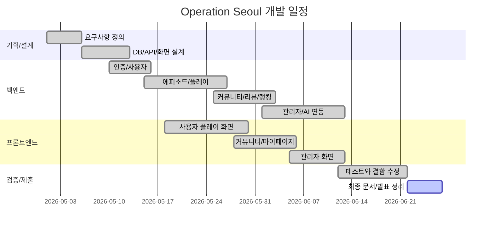

# WBS 및 Gantt Chart

## 1. WBS

| WBS | 작업 | 세부 내용 | 산출물 |
| --- | --- | --- | --- |
| 1.0 | 기획 | 문제 정의, 사용자/관리자 범위 확정 | 요구사항 정의서 |
| 1.1 | 기능 정의 | 인증, 플레이, 커뮤니티, 관리자, AI 기능 정의 | 기능 목록 |
| 1.2 | 비기능 정의 | 보안, 운영, 모바일 사용성, 검증 기준 | 비기능 요구사항 |
| 2.0 | 설계 | 아키텍처, DB, API, 화면 흐름 설계 | 설계 문서 |
| 2.1 | DB 설계 | 사용자, 에피소드, 장소, 퍼즐, 커뮤니티 ERD | `schema.sql` |
| 2.2 | API 설계 | 사용자/관리자 REST API 구조 | API 목록 |
| 2.3 | 화면 설계 | 라우트, 주요 화면, 사용자 흐름 | 화면 설계서 |
| 3.0 | 백엔드 구현 | Spring Boot API와 비즈니스 로직 구현 | Back-End 소스 |
| 3.1 | 인증/보안 | JWT, 권한, 현재 사용자 Resolver | 인증 모듈 |
| 3.2 | 플레이 | 에피소드, 지도, 도착, 퍼즐, 단서, 최종 추리 | 플레이 API |
| 3.3 | 커뮤니티 | 권역 게시판, 답변, 좋아요, 리뷰 | 커뮤니티 API |
| 3.4 | 관리자 | 회원/리뷰/에피소드 운영 | 관리자 API |
| 3.5 | 외부 API/AI | TourAPI, Kakao Local, Gemini 연동 | 외부 연동 모듈 |
| 4.0 | 프론트 구현 | Vue 화면과 API 연동 | Front-End 소스 |
| 4.1 | 사용자 화면 | 로그인, 목록, 지도, 추리, 리포트 | 사용자 UI |
| 4.2 | 커뮤니티 화면 | 게시판, 상세, 작성, 댓글 | 커뮤니티 UI |
| 4.3 | 관리자 화면 | 에피소드/회원/리뷰 관리 | 관리자 UI |
| 5.0 | 테스트 | 빌드, 단위 테스트, 스모크 테스트 | 테스트 결과 |
| 6.0 | 제출 정리 | 문서, 보고서, 발표 자료 정리 | 최종 산출물 |

## 2. Gantt Chart

## 3. 역할 분담 기준

| 역할 | 담당 |
| --- | --- |
| PM/기획 | 요구사항, 범위 조정, 발표 구성 |
| Backend | API, DB, 보안, 외부 API/AI 연동 |
| Frontend | Vue 화면, 라우팅, 상태 관리, 모바일 UI |
| QA/문서 | 테스트, 검증표, 최종 보고서, 발표 자료 |

