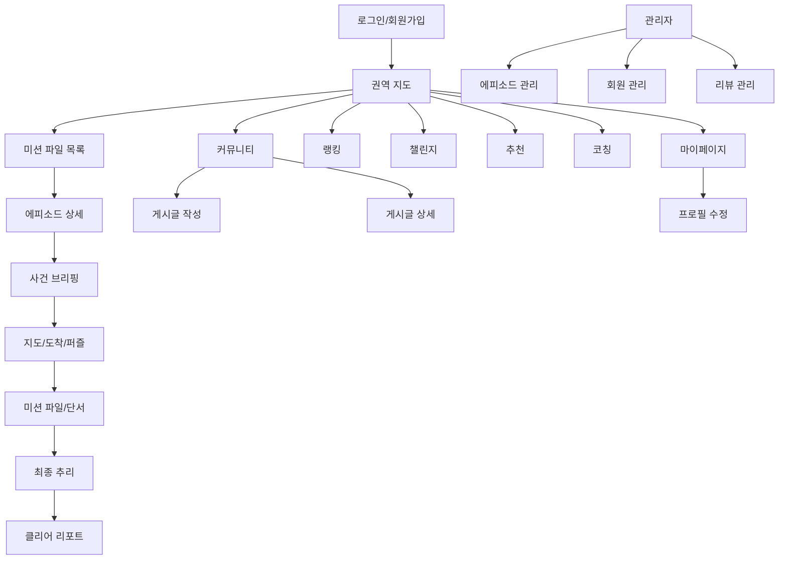

# 화면 설계서

## 1. 정보 구조

## 2. 주요 화면

| 화면 | 경로 | 핵심 구성 |
| --- | --- | --- |
| 인트로 | `/intro` | 로그인/회원가입, JWT 저장 |
| 권역 지도 | `/regions` | 전국 권역 선택, 하단 내비게이션 |
| 에피소드 목록 | `/episodes` | 카드 목록, 권역 필터, 관심 등록 |
| 에피소드 상세 | `/episodes/:episodeId` | 사건 개요, 난이도, 시작 버튼 |
| 사건 브리핑 | `/episodes/:episodeId/briefing` | 목표, 규칙, 현장 이동 전 안내 |
| 지도 플레이 | `/episodes/:episodeId/map` | Kakao 지도, 장소 마커, 도착 판정, 퍼즐 |
| 미션 파일 | `/episodes/:episodeId/case-file` | 단서, 증거, 용의자, 조사 기록 |
| 최종 추리 | `/episodes/:episodeId/deduction` | 질문 입력, 추리 로그, 최종 답 제출 |
| 클리어 리포트 | `/episodes/:episodeId/clear-report` | 점수, 시간, 해설, 리뷰 |
| 커뮤니티 허브 | `/community` | 권역별 게시글, 공지, 검색, 정렬 |
| 게시글 작성 | `/community/write` | 권역 선택, 제목/내용, 관리자 공지 옵션 |
| 게시글 상세 | `/community/:regionId/posts/:questionId` | 본문, 댓글, 좋아요, 작성자 메뉴 |
| 관리자 에피소드 | `/admin/episodes` | 초안 생성, 검증, 공개 전환 |
| 관리자 회원 | `/admin/users` | 검색, 상태/권한 수정 |
| 관리자 리뷰 | `/admin/reviews` | 숨김/복구/삭제 |

## 3. 사용자 플레이 흐름

1. 로그인한다.
2. 권역 또는 에피소드 목록에서 미션 파일을 선택한다.
3. 사건 브리핑을 확인하고 플레이를 시작한다.
4. 지도에서 조사 장소로 이동한다.
5. 도착 판정 후 퍼즐을 푼다.
6. 해금된 단서와 증거를 미션 파일에서 확인한다.
7. 최종 장소에 도착해 추리를 시작한다.
8. 최종 정답을 제출하고 클리어 리포트를 확인한다.
9. 리뷰, 랭킹, 챌린지, 코칭 화면으로 후속 활동을 한다.

## 4. 관리자 운영 흐름

1. 관리자 계정으로 로그인한다.
2. TourAPI/Kakao Local 후보를 조회한다.
3. Gemini 또는 규칙 기반 초안 생성을 실행한다.
4. 장소, 퍼즐, 단서, 최종 정답 계약을 검수한다.
5. publish readiness를 확인한다.
6. DRAFT를 PUBLISHED로 전환한다.
7. 회원과 리뷰를 운영한다.

