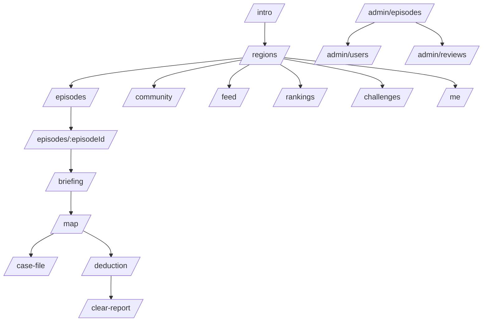

# 화면 설계 정리

## 1. 화면 흐름

## 2. 사용자 화면

| 화면 | 들어간 기능 |
| --- | --- |
| Intro | 로그인, 회원가입, Google/Kakao 로그인 |
| RegionMap | 권역 지도, 권역 카드, 좋아요/즐겨찾기 |
| EpisodeList | 에피소드 목록, 검색/필터, 관심 등록 |
| EpisodeDetail | 사건 정보, 난이도, 예상 시간, 시작 |
| Briefing | 사건 소개와 플레이 안내 |
| EpisodeMap | Kakao 지도, Tmap 길찾기, 도착 판정, 퍼즐 |
| CaseFile | 단서, 증거, 용의자, 메모 |
| FinalDeduction | 질문, 가설, 최종 정답 |
| ClearReport | 점수, 해설, 리뷰 |
| CommunityHub | 전체 지역 Q&A 모음 |
| Feed | 프로필, 게시글, 클리어 맵 |
| Ranking/Challenges | 랭킹과 챌린지 |
| Recommendations/Coaching | 추천과 코칭 |
| MyPage | 프로필, 관심 목록, 팔로우, 내 리뷰 |

## 3. 관리자 화면

| 화면 | 들어간 기능 |
| --- | --- |
| AdminEpisodes | 에피소드 CRUD, 장소/퍼즐/자료 편집, AI 초안, readiness |
| AdminUsers | 회원 검색, 권한/상태 수정, 삭제 |
| AdminReviews | 리뷰 조회, 숨김, 복구, 삭제 |

## 4. 화면에서 지킨 기준

- 모바일에서 먼저 보기 좋게 잡았다.
- 플레이 화면은 지도, 퍼즐, 사건 파일로 바로 이동할 수 있게 했다.
- 최종 장소나 정답이 화면에서 바로 보이지 않게 했다.
- 관리자 화면은 공개 전에 빠진 데이터가 보이도록 했다.
