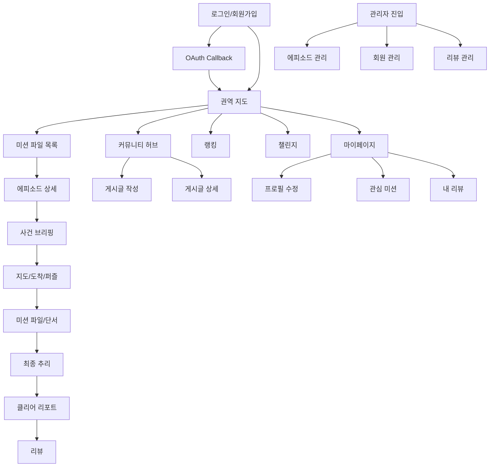
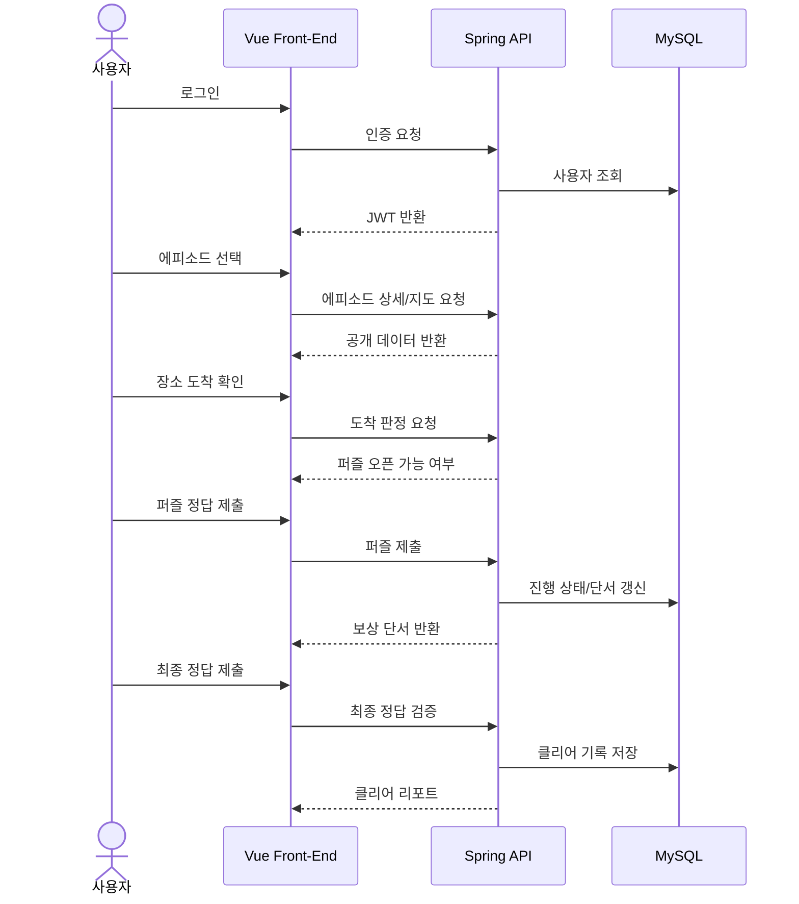
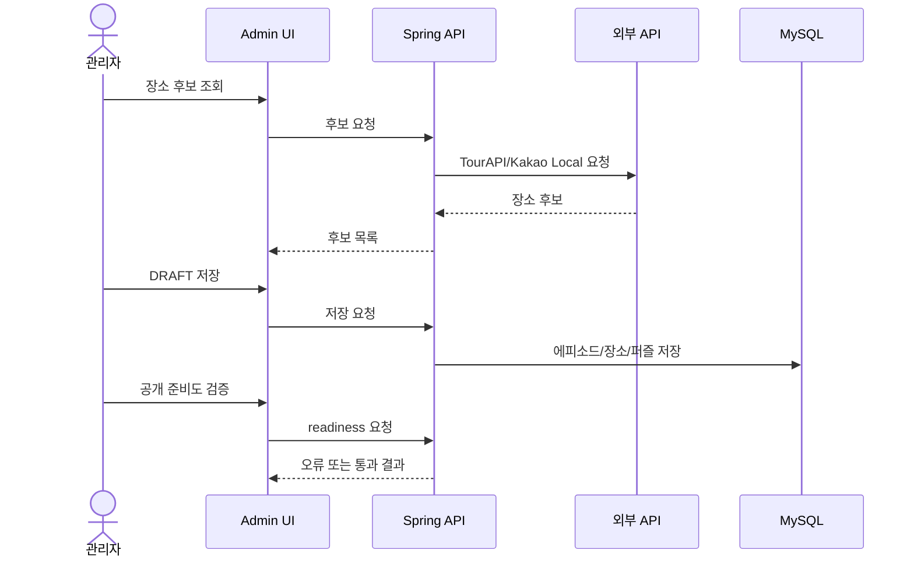

# 화면 설계서

## 1. 정보 구조



## 2. 화면 목록

| 화면 | 경로 | 핵심 구성 | 권한 |
| --- | --- | --- | --- |
| 인트로 | `/intro` | 일반 로그인, 회원가입, Google/Kakao 로그인 | 비회원 |
| OAuth Callback | `/oauth/callback` | OAuth code/token 처리, 세션 저장 | 비회원 |
| 권역 지도 | `/regions` | 권역 SVG 지도, 전체 사건 보기, 로그아웃 | 사용자 |
| 에피소드 목록 | `/episodes` | 검색, 지역/시대 필터, 카드 목록, 관심 등록 | 사용자 |
| 에피소드 상세 | `/episodes/:episodeId` | 사건 개요, 난이도, 시작 버튼 | 사용자 |
| 사건 브리핑 | `/episodes/:episodeId/briefing` | 목표, 팀 안내, 주의사항, 시작 | 사용자 |
| 지도 플레이 | `/episodes/:episodeId/map` | Kakao 지도, 마커, 팝업, 퍼즐, 단서 보드 | 사용자 |
| 미션 파일 | `/episodes/:episodeId/case-file` | 증거, 용의자, 조사 기록, 최종 추리 이동 | 사용자 |
| 최종 추리 | `/episodes/:episodeId/deduction` | 질문, 가설, 최종 정답 제출 | 사용자 |
| 클리어 리포트 | `/episodes/:episodeId/clear-report` | 점수, 시간, 해설, 리뷰 이동 | 사용자 |
| 커뮤니티 | `/community` | 권역별 게시글, 공지, 검색 | 사용자 |
| 게시글 작성 | `/community/write` | 권역, 제목, 내용, 공지 여부 | 사용자/관리자 |
| 게시글 상세 | `/community/:regionId/posts/:questionId` | 본문, 댓글, 좋아요, 수정/삭제 | 사용자 |
| 랭킹 | `/rankings` | 순위, 내 기록, 플레이어 랭킹 | 사용자 |
| 챌린지 | `/challenges` | 참여 가능 챌린지, 내 진행률 | 사용자 |
| 마이페이지 | `/me` | 프로필, 팔로우, 내 활동 이동 | 사용자 |
| 관리자 에피소드 | `/admin/episodes` | 후보 조회, 검증, 공개 | 관리자 |
| 관리자 회원 | `/admin/users` | 회원 검색, 권한/상태 수정 | 관리자 |
| 관리자 리뷰 | `/admin/reviews` | 리뷰 숨김/복구/삭제 | 관리자 |

## 3. 공통 레이아웃 규칙

| 항목 | 설계 기준 |
| --- | --- |
| 화면 폭 | 모바일 우선, 주요 콘텐츠는 `min(100%, 880~1180px)` 중앙 정렬 |
| 내비게이션 | 사용자 주요 화면은 하단 탭 내비게이션 사용 |
| 색상 | 네이비/슬레이트 배경, 황동색 강조, 하늘색 주요 제출 버튼 |
| 버튼 | 주요 행동은 굵은 글씨, 충분한 대비, hover/active 상태 제공 |
| 팝업 | 퍼즐, 단서 보드, 보상 팝업은 화면 중앙 또는 지도 위치 기준 표시 |
| 접근성 | 버튼 `aria-label`, 키보드 Enter/Space 대응, 입력 focus 표시 |

## 4. 주요 화면 와이어프레임

### 4.1 인트로

```text
+------------------------------------------------+
| OPERATION: KOREA                               |
| 서비스 소개 문구                               |
|                                                |
| [ 이메일 입력 ]                                |
| [ 비밀번호 입력 ]                              |
| [ 로그인 ]                                     |
|                                                |
| [ Google로 로그인 ]                            |
| [ Kakao로 로그인 이미지 버튼 ]                 |
|                                                |
| 회원가입 입력 영역                             |
+------------------------------------------------+
```

| 요소 | 동작 |
| --- | --- |
| 로그인 버튼 | `/api/v1/auth/login` 호출 후 세션 저장 |
| Google 버튼 | Google OAuth 플로우 시작 |
| Kakao 버튼 | Kakao OAuth 플로우 시작 |
| 회원가입 | `/api/v1/auth/register` 호출 |

### 4.2 권역 지도

```text
+------------------------------------------------+
| REGION SELECT                    [전체 사건]   |
| 사용자 안내 문구                  [로그아웃]   |
+------------------------------------------------+
|                                                |
|      [대한민국 권역 SVG 지도]                  |
|      권역 클릭 시 에피소드 목록으로 이동       |
|                                                |
| 안내 문구                                      |
+------------------------------------------------+
| 하단 내비게이션                                |
+------------------------------------------------+
```

| 요소 | 동작 |
| --- | --- |
| 권역 클릭 | `/episodes?areaCode={code}` 이동 |
| 전체 사건 보기 | `/episodes` 이동 |
| 로그아웃 | 세션 제거 후 `/intro` 이동 |

### 4.3 에피소드 목록

```text
+------------------------------------------------+
| CASE FILES                                     |
| [검색어 입력] [지역 select] [시대 select]      |
| [검색] [초기화]                                |
+------------------------------------------------+
| [CASE 01 카드] 제목/부제/시대/장르/난이도      |
|   [관심] [랭킹] [미션 파일 열기]               |
| [CASE 02 카드] ...                             |
+------------------------------------------------+
| 페이지네이션                                   |
+------------------------------------------------+
```

| 요소 | 동작 |
| --- | --- |
| 검색어 | 제목, 장소, 장르 키워드 검색 |
| 지역/시대 필터 | 조건별 에피소드 조회 |
| 관심 버튼 | favorite 등록/해제 |
| 카드 클릭 | 에피소드 상세 이동 |

### 4.4 지도 플레이

```text
+------------------------------------------------+
| FIELD MAP                         [단서 보드]  |
+------------------------------------------------+
| 상태 메시지 영역                                |
+------------------------------------------------+
| 범례 START / 조사 / FINAL                       |
| +--------------------------------------------+ |
| | Kakao Map                                  | |
| |  [S] [I] [I] ... [F] 마커                  | |
| |  CLUE TIME 타이머                          | |
| |  장소 클릭 팝업                            | |
| |  [길찾기] [도착 확인]                      | |
| +--------------------------------------------+ |
| 안내 문구                                      |
+------------------------------------------------+
```

| 요소 | 동작 |
| --- | --- |
| 마커 | 장소 팝업 표시 |
| 길찾기 | TMAP 경로 요청, 실패 시 직선 경로 |
| 도착 확인 | GPS 반경 확인 후 퍼즐 오픈 |
| 퍼즐 성공 | 퍼즐 팝업과 장소 팝업 닫힘, 보상 팝업 표시 |
| 단서 보드 | 현재까지 해금된 단서 확인 |

### 4.5 퍼즐/미니게임 팝업

```text
+----------------------------------------+
| 미션 타입 / 난이도              [닫기] |
| 미션 제목                               |
| 안내 문구                               |
| 문제 또는 미니게임 영역                 |
|                                        |
| [미션 결과 제출] 또는 [정답 제출]       |
| 결과 메시지                             |
+----------------------------------------+
```

| 미니게임 | 상호작용 |
| --- | --- |
| 기억 카드 | 같은 단서 쌍을 맞추면 카드가 초록색으로 고정 |
| 색깔 반전 | 버튼 배경이 실제 선택 색상과 동일 |
| 빠른 탭 | 빨간색 탭 버튼으로 목표 횟수 입력 |
| 숫자/패턴/방향 | 하늘/네이비 계열 버튼과 명확한 선택 상태 |

### 4.6 미션 파일

```text
+------------------------------------------------+
| 사건 파일 표지                    [조사 지도]  |
| 사건 개요 / 목표 / 진행 상태                   |
+------------------------------------------------+
| [단서 요약] [증거 카드] [용의자 카드]          |
| 잠김/해금 상태 구분                             |
| 카드 클릭 시 확대 보기                          |
+------------------------------------------------+
| [최종 추리로 이동]                              |
+------------------------------------------------+
```

| 요소 | 동작 |
| --- | --- |
| 증거 카드 | 해금된 증거 이미지/요약 표시 |
| 용의자 카드 | 해금 조건 충족 시 상세 정보 표시 |
| 최종 추리 버튼 | 조건 충족 후 deduction 화면 이동 |

### 4.7 최종 추리

```text
+------------------------------------------------+
| FINAL DEDUCTION                                |
| 남은 질문 수 / 패널티 안내                      |
+------------------------------------------------+
| [질문 입력] [질문하기]                          |
| Q/A 로그                                        |
+------------------------------------------------+
| [최종 정답 입력] [제출]                         |
+------------------------------------------------+
```

| 요소 | 동작 |
| --- | --- |
| 질문하기 | 제한형 답변 기록 |
| 가설 제출 | reasoning answer 저장 |
| 최종 제출 | 정답 비교, 성공 시 클리어 리포트 이동 |

### 4.8 관리자 에피소드 관리

```text
+------------------------------------------------+
| ADMIN EPISODES                    [새 에피소드]|
+------------------------------------------------+
| 좌측: 에피소드 목록 / 검색                     |
| 우측: 상세 편집                                |
| - 기본 정보                                    |
| - 장소/퍼즐/힌트                               |
| - 용의자/증거                                  |
| - 공개 준비도 검증                             |
+------------------------------------------------+
| [DRAFT 저장] [검증] [공개 전환]                |
+------------------------------------------------+
```

| 요소 | 동작 |
| --- | --- |
| 장소 후보 조회 | TourAPI/Kakao Local 후보 반환 |
| 공개 준비도 | 필수 단서, 증거, 용의자, 최종 정답 검증 |
| 공개 전환 | 검증 통과 시 PUBLISHED |

## 5. 사용자 플레이 흐름



## 6. 관리자 운영 흐름



## 7. 입력/검증 규칙

| 화면 | 입력 | 검증 |
| --- | --- | --- |
| 로그인 | 이메일, 비밀번호 | 필수값, 계정 상태 |
| 에피소드 검색 | keyword, areaCode, era | 빈 값 허용, 서버 필터 |
| 퍼즐 | 정답 문자열 또는 미니게임 proof | 서버 정답 비교 |
| 최종 추리 | 질문, 가설, 최종 정답 | 질문 수 제한, 금지 정보 보호 |
| 리뷰 | 평점, 난이도, 내용, 스포일러 여부 | 클리어 여부, 중복 리뷰 |
| 관리자 검증 | 지역, 장소 후보 | 단서/증거/정답 검증 |
| 이미지 URL | 외부 이미지 URL | 공개 접근 가능한 HTTP/HTTPS URL |

## 8. 반응형 기준

| 화면 폭 | 동작 |
| --- | --- |
| 430px 이하 | 카드 1열, 버튼 세로 배치, 지도 팝업 폭 축소 |
| 560px 이하 | 목록/카드 그리드 1열 |
| 840px 이하 | 헤더 액션 줄바꿈, 관리자 편집 영역 축소 |
| 900px 이상 | 지도 화면 하단 여백 축소, 데스크톱 레이아웃 사용 |
