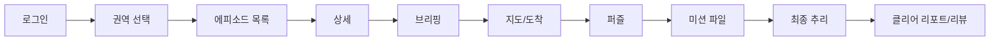

# 화면 설계서

작성일: 2026-06-25

## 1. 주요 화면 목록

| 화면 | Route | 목적 | 상태 |
| --- | --- | --- | --- |
| 로그인/회원가입 | `/intro` | 인증 진입 | 완료 |
| 권역 선택 | `/regions` | SVG 권역 선택 | 완료 |
| 에피소드 목록 | `/episodes?areaCode=...` | 공개 미션 파일 목록 | 구현, UI 개선 중 |
| 에피소드 상세 | `/episodes/:episodeId` | 미션 개요와 시작 | 완료 |
| 브리핑 | `/episodes/:episodeId/briefing` | 사건 소개 | 완료 |
| 미션 지도 | `/episodes/:episodeId/map` | 장소 이동/도착/퍼즐 | 완료 |
| 미션 파일 | `/episodes/:episodeId/case-file` | 단서/증거/용의자 확인 | 완료 |
| 최종 추리 | `/episodes/:episodeId/deduction` | 질문/가설/정답 제출 | 완료 |
| 클리어 리포트 | `/episodes/:episodeId/clear-report` | 결과/해설/리뷰 | 완료 |
| 마이페이지 | `/me` | 관심목록, 팔로우, 내 리뷰 | MVP 완료 |
| 챌린지 | `/challenges` | 챌린지 참여/진행률 | MVP 완료 |
| 추천 | `/recommendations` | 추천 에피소드 | MVP 완료 |
| 코칭 | `/coaching` | 플레이 분석 | MVP 완료 |
| 관리자 에피소드 | `/admin/episodes` | 초안/검수/공개 | 완료 |
| 관리자 회원 | `/admin/users` | 회원 검색/수정 | 완료 |
| 관리자 리뷰 | `/admin/reviews` | 리뷰 숨김/복구/삭제 | 완료 |

## 2. 핵심 사용자 흐름



## 3. 에피소드 목록 화면 설계 기준

요구사항: 한 화면 안에 헤더, 2열 카드 목록, 페이지네이션, 하단 네비게이션, AI 버튼이 들어와야 한다.

현재 구현:

- 카드 목록: 2열 x 3행.
- 하단 네비: 고정.
- 페이지네이션: 문서 흐름 안에서 하단 네비 위에 배치.
- AI 버튼: 우하단 플로팅.

현재 보완 필요:

- 하단 네비와 페이지네이션 간격이 화면 높이에 따라 좁아질 수 있다.
- 한 화면 고정 요구 때문에 카드 내부 정보량을 줄이는 trade-off가 있다.
- 실 서비스라면 화면 높이 720px 이하에서는 카드 2행 + 스크롤 또는 내부 목록 스크롤 허용이 더 안정적이다.

권장 수정 위치:

- `frontend/src/views/EpisodeListView.vue`
- `frontend/src/components/MainBottomNav.vue`

권장 수정 방향:

```css
.episode-page {
  display: grid;
  grid-template-rows: auto 1fr auto;
}

.episode-list {
  min-height: 0;
}

.pagination {
  margin-bottom: 18px;
}
```

## 4. 화면별 UI 보완 체크리스트

| 화면 | 보완 사항 |
| --- | --- |
| 에피소드 목록 | 하단 네비/페이지네이션/AI 버튼 간격, 카드 내부 정보 밀도 |
| 권역 지도 | SVG 권역 hit area, 모바일 라벨 겹침 여부 |
| 관리자 에피소드 | 입력 폼 길이, 초안 생성 로딩/실패 상태 |
| 지도 화면 | 실제 모바일 Kakao Map/Tmap 실행 확인 |
| 최종 추리 | AI 답변 제한/정답 노출 방지 메시지 |
| 마이페이지 | 관심/팔로우/리뷰 탭 구분 개선 |

## 5. 발표용 화면 캡처 권장 목록

1. 로그인/회원가입
2. 권역 선택 지도
3. 에피소드 목록
4. 에피소드 상세/브리핑
5. 미션 지도와 장소 도착
6. 퍼즐 풀이
7. 미션 파일 단서 해금
8. 최종 추리
9. 클리어 리포트/리뷰
10. 관리자 에피소드 생성/AI 초안
