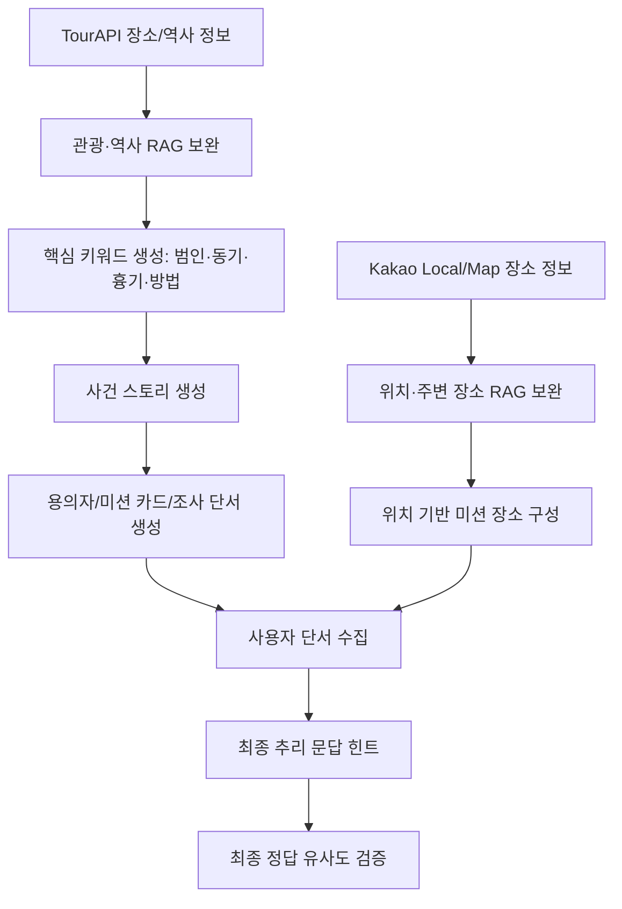

# 외부 API 및 생성형 AI 활용 내용

작성일: 2026-06-25

## 1. 외부 API 활용 개요

| API | 사용 위치 | 목적 | 상태 |
| --- | --- | --- | --- |
| TourAPI | Back-End 관리자 에피소드 생성 | 기준 장소 후보 조회 | 구현 |
| Kakao Local API | Back-End 관리자 에피소드 생성 | 주변 장소 후보 보강 | 구현 |
| Kakao Map JavaScript | Front-End 지도 화면 | 미션 장소 지도 표시 | 구현 |
| Tmap | Front-End 지도 화면 | 길찾기 실행 | 구현 |
| Gemini API | Back-End 관리자 에피소드 생성 | 미션 초안/퍼즐/단서 생성 | 구현 |

## 2. TourAPI

활용:

- 권역/장소 기반 후보를 조회한다.
- 관리자 화면에서 실제 장소 후보를 선택해 미션의 기준 장소로 사용한다.

관련 파일:

- `TourApiService`
- `ExternalPlaceResearchService`
- `AdminEpisodeController`

운영 주의:

- `TOURAPI_SERVICE_KEY` 환경변수 필요.
- API 응답의 좌표/명칭은 공개 전 현장 검수 필요.

## 3. Kakao Local / Kakao Map

활용:

- 기준 장소 주변 후보를 보강한다.
- 사용자 지도 화면에서 미션 장소를 표시한다.

관련 파일:

- `KakaoLocalCandidateService`
- `EpisodeMapView.vue`

운영 주의:

- `KAKAO_REST_API_KEY` 필요.
- 프론트는 `VITE_KAKAO_MAP_KEY` 필요.
- Kakao 개발자 콘솔에 실제 배포 도메인 등록 필요.

## 4. Tmap

활용:

- 사용자가 미션 장소까지 이동할 때 길찾기 진입을 지원한다.

운영 주의:

- `VITE_TMAP_APP_KEY` 필요.
- 모바일 브라우저/앱 실행 방식은 실기기 검증 필요.

## 5. Gemini

활용:

- 관리자 에피소드 생성에서 초안 생성.
- 사건 개요, 퍼즐, 단서, 증거, 용의자 텍스트의 생성 보조.
- 초안 생성 후 관리자 검수 및 publish-readiness 검사를 거쳐 공개.

관련 파일:

- `AdminEpisodeGeminiService`
- `GeminiContentClient`
- `GeminiDraftGenerator`
- `GeminiDraftPromptBuilder`
- `AiEpisodeDraftValidator`

현재 제한:

- AI 추천/코칭이 필수 기능으로 업데이트되었으므로 현재 규칙 기반 성격은 보완 대상이다.
- 실시간 추리 채팅은 정답 노출 방지를 위해 제한형 응답 중심이다.
- 발표에서는 현재 상태와 보완 계획을 함께 설명하는 것이 정확하다.

## 6. AI 안전장치

- 현장에 없는 관찰 요소를 생성하지 않도록 guardrail 적용.
- 최종 정답/최종 장소 직접 노출 방지.
- DRAFT 상태에서 관리자 검수 후 PUBLISHED 전환.
- publish-readiness로 필수 필드와 플레이 가능성 점검.

## 7. AI 오케스트레이션 파이프라인

초기에는 TourAPI 기반 관광·역사 정보와 Kakao Map 기반 위치·장소 정보가 하나의 RAG 흐름 안에서 함께 보완되었다. 이 구조는 역사적 배경 생성 단계에 위치·경로 정보가 섞이는 데이터 오염을 만들었다. 이후 키워드 생성 AI가 실제 장소명이나 지도 기반 정보를 사건 핵심 키워드로 잘못 반영하는 문제가 있었다.

개선 후에는 AI 호출을 역할별로 분리했다.

핵심 개선점:

- TourAPI 정보는 역사·문화 배경 생성에 집중한다.
- Kakao 정보는 위치·장소·경로 기반 미션 구성에 집중한다.
- 키워드, 스토리, 단서, 추리 검증 단계를 분리한다.
- 각 단계 산출물을 다음 단계 입력으로 넘겨 디버깅과 품질 개선을 쉽게 한다.

## 8. AI 응답 UX와 품질 개선

| 문제 | 개선 |
| --- | --- |
| AI 응답 대기 시간이 길게 느껴짐 | 비동기 버퍼와 타자기 효과로 응답이 진행 중임을 표시 |
| 프롬프트 품질이 낮아 fallback이 과도하게 개입 | 필터링을 정답 유출/핵심 논리 오류 중심으로 단순화하고 프롬프트 강화 |
| 한 부분 수정 시 다른 AI 단계 품질 저하 | slf4j 로그로 입력/중간 산출물/검증 실패 사유를 분석 |
| 콘텐츠 증가로 목록 렌더링 부담 증가 | `LIMIT OFFSET` 기반 pagination으로 필요한 데이터만 조회 |

## 9. AI 추천/코칭 필수 기능 구현 방향

AI 추천/코칭이 필수 기능으로 업데이트되었으므로, 기존 규칙 기반 결과에 생성형 AI 설명을 결합하는 구조가 필요하다.

권장 구조:

1. 기존 서비스가 추천 후보와 코칭 지표를 계산한다.
2. 계산 결과를 Gemini 입력으로 전달한다.
3. Gemini가 사용자에게 보여줄 추천 이유와 코칭 설명을 생성한다.
4. AI 호출 실패 시 기존 규칙 기반 응답을 fallback으로 제공한다.
5. 화면에서는 정량 근거와 AI 자연어 설명을 분리해 보여준다.

대상 파일:

- `EpisodeRecommendationService`
- `CoachingService`
- `GeminiContentClient`
- `RecommendationsView.vue`
- `CoachingView.vue`
