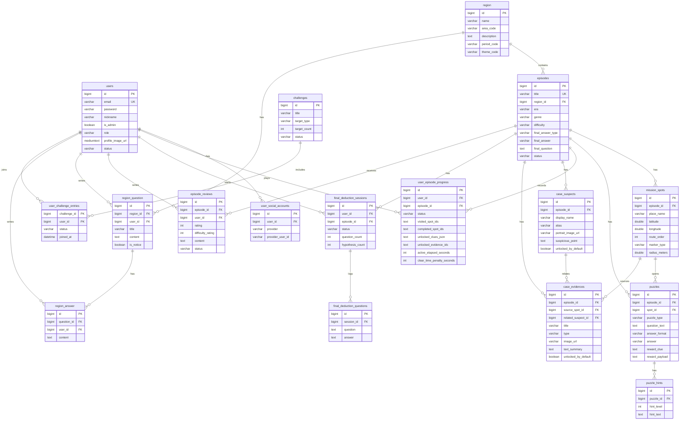

# ER Diagram

## 1. 상세 ER Diagram

```mermaid
erDiagram
    users {
        bigint id PK
        varchar email UK
        varchar password
        varchar nickname
        boolean is_admin
        varchar role
        mediumtext profile_image_url
        varchar status
    }

    user_social_accounts {
        bigint id PK
        bigint user_id FK
        varchar provider
        varchar provider_user_id
    }

    region {
        bigint id PK
        varchar name
        varchar area_code
        text description
        varchar period_code
        varchar theme_code
    }

    episodes {
        bigint id PK
        varchar title UK
        bigint region_id FK
        varchar era
        varchar genre
        varchar difficulty
        varchar final_answer_type
        varchar final_answer
        text final_question
        varchar status
    }

    mission_spots {
        bigint id PK
        bigint episode_id FK
        varchar place_name
        double latitude
        double longitude
        int route_order
        varchar marker_type
        double radius_meters
    }

    puzzles {
        bigint id PK
        bigint episode_id FK
        bigint spot_id FK
        varchar puzzle_type
        text question_text
        varchar answer_format
        varchar answer
        text reward_clue
        text reward_payload
    }

    puzzle_hints {
        bigint id PK
        bigint puzzle_id FK
        int hint_level
        text hint_text
    }

    user_episode_progress {
        bigint id PK
        bigint user_id FK
        bigint episode_id FK
        varchar status
        text visited_spot_ids
        text completed_spot_ids
        text unlocked_clues_json
        text unlocked_evidence_ids
        int active_elapsed_seconds
        int clear_time_penalty_seconds
    }

    case_suspects {
        bigint id PK
        bigint episode_id FK
        varchar display_name
        varchar alias
        varchar portrait_image_url
        text suspicious_point
        boolean unlocked_by_default
    }

    case_evidences {
        bigint id PK
        bigint episode_id FK
        bigint source_spot_id FK
        bigint related_suspect_id FK
        varchar title
        varchar type
        varchar image_url
        text text_summary
        boolean unlocked_by_default
    }

    final_deduction_sessions {
        bigint id PK
        bigint user_id FK
        bigint episode_id FK
        varchar status
        int question_count
        int hypothesis_count
    }

    final_deduction_questions {
        bigint id PK
        bigint session_id FK
        text question
        text answer
    }

    episode_reviews {
        bigint id PK
        bigint episode_id FK
        bigint user_id FK
        int rating
        int difficulty_rating
        text content
        varchar status
    }

    region_question {
        bigint id PK
        bigint region_id FK
        bigint user_id FK
        varchar title
        text content
        boolean is_notice
    }

    region_answer {
        bigint id PK
        bigint question_id FK
        bigint user_id FK
        text content
    }

    challenges {
        bigint id PK
        varchar title
        varchar target_type
        int target_count
        varchar status
    }

    user_challenge_entries {
        bigint challenge_id PK
        bigint user_id PK
        varchar status
        datetime joined_at
    }

    users ||--o{ user_social_accounts : has
    region ||--o{ episodes : contains
    episodes ||--o{ mission_spots : has
    episodes ||--o{ puzzles : has
    mission_spots ||--o{ puzzles : opens
    puzzles ||--o{ puzzle_hints : has
    users ||--o{ user_episode_progress : plays
    episodes ||--o{ user_episode_progress : records
    episodes ||--o{ case_suspects : has
    episodes ||--o{ case_evidences : has
    mission_spots ||--o{ case_evidences : sources
    case_suspects ||--o{ case_evidences : relates
    users ||--o{ final_deduction_sessions : starts
    episodes ||--o{ final_deduction_sessions : has
    final_deduction_sessions ||--o{ final_deduction_questions : logs
    users ||--o{ episode_reviews : writes
    episodes ||--o{ episode_reviews : receives
    region ||--o{ region_question : has
    users ||--o{ region_question : writes
    region_question ||--o{ region_answer : has
    users ||--o{ region_answer : writes
    challenges ||--o{ user_challenge_entries : includes
    users ||--o{ user_challenge_entries : joins
```

## 2. 참고

상세 스키마 원본은 `backend/src/main/resources/schema.sql`과 `EpisodeSchemaMigration.java`에 있다.

