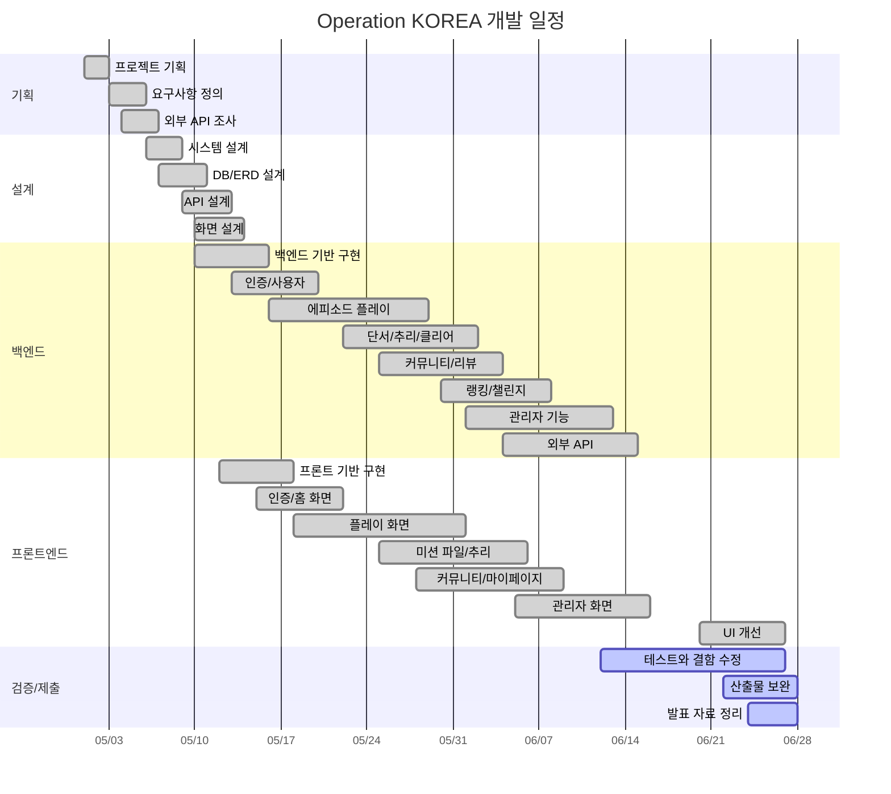

# Gantt Chart

## 마일스톤

| 마일스톤 | 기준일 | 완료 기준 | 상태 |
| --- | --- | --- | --- |
| M1. 요구사항 확정 | 2026-05-05 | 주요 기능/비기능 요구사항 정의 | 완료 |
| M2. 설계 확정 | 2026-05-13 | 아키텍처, ERD, 화면 흐름 확정 | 완료 |
| M3. 플레이 MVP | 2026-05-31 | 에피소드 선택부터 퍼즐 풀이까지 가능 | 완료 |
| M4. 추리/커뮤니티 완성 | 2026-06-08 | 최종 추리, 리뷰, 커뮤니티 가능 | 완료 |
| M5. 관리자 기능 완성 | 2026-06-15 | 공개 준비도, 관리자 기능 가능 | 완료 |
| M6. 최종 제출 | 2026-06-27 | 문서, 발표, 빌드 검증 정리 | 진행 |

