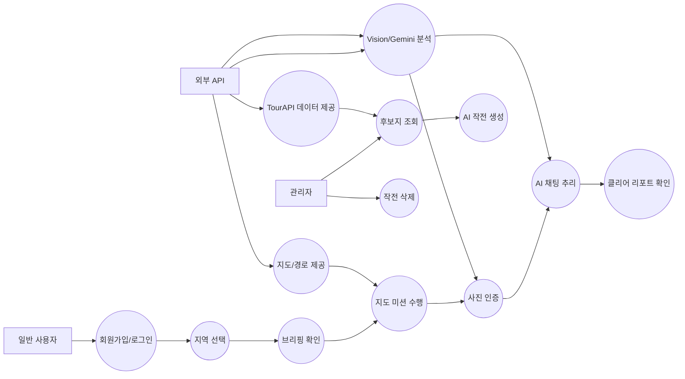
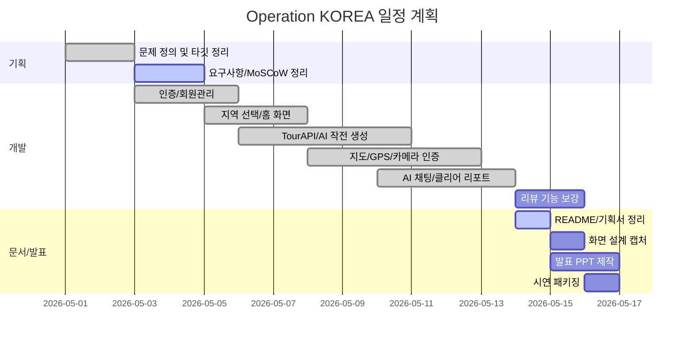
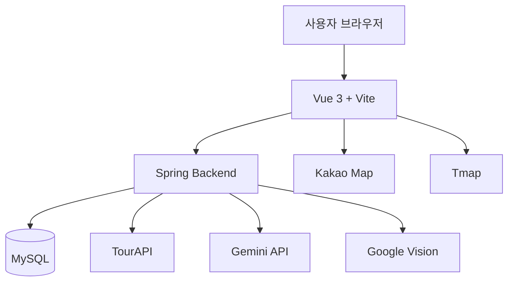

# Operation KOREA 발표용 통합 기획서

작성 기준: 2026-05-14  


## 1. 아이디어 도출

### 1.1 문제 정의서

| 문제 | 근거 | 서비스 관점 해결 방향 |
| --- | --- | --- |
| 국내 관광 체류 시간이 짧고 특정 랜드마크에 집중됨 | 제안서에서 랜드마크 단기 방문과 지역 상권 파급효과 부족을 핵심 문제로 정의 | 최종 목적지 주변 POI를 힌트 미션으로 연결해 걷는 동선을 생성 |
| 관광 정보 소비가 수동적임 | 기존 관광은 정보 열람과 단순 방문 중심 | AI 스토리, GPS, 카메라 인증, 채팅 추리로 상호작용 경험 제공 |
| 지역별 콘텐츠 제작 비용이 큼 | 지역마다 수작업 기획이 필요 | TourAPI + Gemini로 장소 데이터 기반 작전 자동 생성 |
| 역사/문화 정보가 재미와 분리됨 | 교육 콘텐츠는 흥미가 떨어지고 게임 콘텐츠는 사실성이 약함 | 게임 중 Fiction, 클리어 후 Fact 구조로 몰입과 학습을 분리 제공 |

### 1.2 대상 사용자

| 사용자군 | 니즈 | 제공 가치 |
| --- | --- | --- |
| MZ 여행자 | SNS에 공유할 특별한 경험, 미션형 여행 | 요원 콘셉트, 클리어 카드, 점수/시간 기록 |
| 가족 관광객 | 아이와 함께 즐길 수 있는 학습형 관광 | 역사 추리, 협력 미션, 클리어 해설 |
| 지자체/소상공인 | 관광객 체류시간과 골목 상권 유입 | 주변 POI 힌트 미션, 지역 상생 동선 |
| 외국인 관광객 | 언어 장벽 없는 딥 로컬 경험 | 향후 다국어 TourAPI와 AI 번역 확장 |

### 1.3 해결방안 구상

1. TourAPI에서 지역 관광지와 상세 설명을 수집한다.
2. 관리자가 최종 목적지와 주변 후보지를 선택한다.
3. Gemini가 브리핑, 힌트, 현장 인증 키워드, 최종 정답 키워드를 생성한다.
4. 사용자는 지도 위에서 힌트 장소를 방문하고 카메라 인증으로 단서를 얻는다.
5. 최종 지점에서 AI 채팅을 통해 수집한 단서를 바탕으로 정답을 추론한다.
6. 클리어 후 실제 역사 정보와 단서 해석을 확인한다.

## 2. 목표 설정

### 2.1 SMART 목표

| 구분 | 목표 |
| --- | --- |
| Specific | TourAPI 기반 관광지를 AI 미션 코스로 변환하고, 사용자가 지도/카메라/채팅으로 완주하는 MVP를 구현한다. |
| Measurable | 지역 1개 이상, 작전 1개 이상, 힌트 미션 3개 + 최종 미션 1개 플로우를 완주 가능하게 한다. |
| Achievable | Vue 3, Spring, MySQL, TourAPI, Kakao Map, Gemini, Vision API를 활용해 MVP 범위로 제한한다. |
| Relevant | 지역 체류시간 증대, 역사 학습, 관광 데이터 활용이라는 제안서 목표와 직접 연결한다. |
| Time-bound | 발표 전까지 README, WBS, 간트차트, 유스케이스, 화면 설계, 발표자료 초안을 완성한다. |

### 2.2 정량 목표

| 지표 | 목표값 | 측정 방법 |
| --- | --- | --- |
| 미션 생성 성공 | 관리자 선택 후 1개 작전 생성 | DB `Region`, `Mission` 저장 확인 |
| 완주 가능성 | 힌트 3개 + 최종 미션 1개 완료 | `GameSession.status=CLEARED` 확인 |
| 화면 범위 | 핵심 화면 6개 이상 | Intro, Home, Briefing, Map, Chat, Clear |
| 응답 지연 | AI 채팅 첫 응답 체감 5초 이내 목표 | 시연 중 수동 측정 |
| 산출물 | 필수 산출물 6종 이상 | README와 본 문서 체크 |

### 2.3 정성 목표

| 목표 | 판단 기준 |
| --- | --- |
| 관광이 게임처럼 느껴질 것 | 사용자가 단순 정보 조회가 아니라 미션 수행 흐름을 인지 |
| 실제 역사와 허구가 구분될 것 | 클리어 화면에서 실제 해설을 분리 제공 |
| 전국 확장 가능성이 보일 것 | 서울 외 권역 선택 및 TourAPI 기반 생성 구조 설명 가능 |
| 발표 시나리오가 명확할 것 | 문제, 해결, 기술, 데모, 기대효과 순서로 설명 가능 |

## 3. 요구사항 분석

### 3.1 MoSCoW 우선순위

| 우선순위 | 요구사항 | 상태 |
| --- | --- | --- |
| Must | 회원가입/로그인/권한 관리 | 구현 |
| Must | 지역 선택 및 작전 카드 조회 | 구현 |
| Must | 관광 콘텐츠 생성/조회 | 구현 |
| Must | 지도 기반 현장 미션 | 구현 |
| Must | AI 채팅 정답 추론 | 구현 |
| Must | 클리어 리포트 | 구현 |
| Must | 리뷰 기능 | 미구현, 제출 공통 요구사항이면 추가 필요 |
| Should | 찜/즐겨찾기 | 미구현 |
| Should | 계획/일정관리 | 미구현 |
| Could | 팔로우/팔로잉 | 미구현 |
| Could | 챌린지 관리 | 일부 점수/시간 기반으로 확장 가능 |
| Could | AI 추천 | 관리자 후보지 생성 일부 구현, 사용자 추천은 미구현 |
| Could | AI 코칭/분석 | 채팅 힌트 일부 구현, 개인화 분석은 미구현 |
| Won't Now | 결제/쿠폰 실사용 | MVP 제외 |

### 3.2 필수/선택 기능

| 구분 | 기능 | 사용자 관점 설명 |
| --- | --- | --- |
| 필수 | 회원관리 | 사용자는 계정을 만들고 진행 기록을 저장한다. |
| 필수 | 콘텐츠 | 사용자는 지역별 작전 콘텐츠를 조회하고 플레이한다. |
| 필수 | 리뷰 | 사용자는 작전 완료 후 경험을 평가한다. 현재 미구현이므로 추가 필요하다. |
| 필수 | 미션 진행 | 사용자는 지도에서 힌트 장소를 방문하고 단서를 얻는다. |
| 필수 | AI 추리 | 사용자는 최종 채팅에서 질문하고 정답을 입력한다. |
| 선택 | 즐겨찾기 | 사용자는 나중에 할 작전을 저장한다. |
| 선택 | 일정관리 | 사용자는 여행 일정에 작전을 넣는다. |
| 선택 | 챌린지 | 사용자는 시간/거리/점수 기반 랭킹에 참여한다. |
| 선택 | AI 추천 | 사용자는 취향과 위치 기반 작전을 추천받는다. |

### 3.3 사용자 심층 연구

| 관점 | 개발자 중심 접근 | 사용자 중심 접근 |
| --- | --- | --- |
| 미션 생성 | API 데이터로 미션을 많이 생성 | 사용자가 이해 가능한 정답과 동선을 우선 |
| 지도 | 좌표 정확도와 API 호출 성공 | 길 찾기, 거리감, 도착 여부가 명확해야 함 |
| AI 힌트 | 정답 판정 정확도 | 너무 직접적이지 않지만 막히지 않을 힌트 |
| 클리어 | DB 상태 갱신 | 내가 무엇을 배웠는지, 왜 이 장소가 중요한지 확인 |

수행 방법:

1. 팀원 2명 이상이 동일 작전을 플레이하며 막히는 지점을 기록한다.
2. 힌트 질문 5개 이상을 입력해 정답 노출 여부를 확인한다.
3. 모바일 브라우저에서 GPS/카메라 권한 흐름을 점검한다.
4. 클리어 후 실제 역사 해설이 허구와 섞이지 않는지 검토한다.

## 4. 유스케이스

### 4.1 Actor

| Actor | 설명 |
| --- | --- |
| 비회원 | 서비스 소개를 보고 회원가입/로그인을 수행 |
| 일반 사용자 | 작전 선택, 미션 수행, AI 채팅, 클리어 기록 확인 |
| 관리자 | 후보지 조회, AI 작전 생성, 작전 삭제 |
| 외부 API | TourAPI, Kakao Map, Tmap, Gemini, Google Vision |

### 4.2 Usecase 목록

| Actor | Usecase |
| --- | --- |
| 일반 사용자 | 로그인, 지역 선택, 브리핑 확인, 지도 미션 수행, 사진 인증, 힌트 확인, AI 질문, 최종 정답 제출, 클리어 리포트 확인 |
| 관리자 | 지역 후보지 조회, 최종 목적지 선택, AI 작전 생성, 작전 삭제 |
| 외부 API | 관광지 데이터 제공, 지도 표시, 도보 경로 계산, 이미지/텍스트 분석, 스토리/힌트 생성 |

### 4.3 유스케이스 다이어그램



## 5. 범위 정의

### 5.1 포함 범위

| 범위 | 내용 |
| --- | --- |
| 회원관리 | 회원가입, 로그인, JWT, 관리자 권한 |
| 관광 콘텐츠 | 지역 카드, 작전 브리핑, 미션 목록 |
| 관리자 생성 | TourAPI 후보 조회, Gemini 작전 생성 |
| 현장 미션 | 지도, GPS 거리, 카메라 인증, 단서 획득 |
| AI 추리 | 힌트 질문, 가설 검증, 정답 판정 |
| 클리어 | 점수, 시간, 거리, 역사 리포트 |

### 5.2 제외 범위

| 제외 항목 | 제외 이유 |
| --- | --- |
| 실제 쿠폰/결제 | MVP 범위 초과 |
| 운영자 대시보드 통계 | 발표 이후 확장 |
| 다국어 전체 지원 | TourAPI 다국어 확장 단계에서 진행 |
| 실시간 랭킹 | 점수 데이터 축적 후 진행 |
| UGC 제작 도구 | 장기 발전 방향 |

### 5.3 크리티컬 패스

```text
환경 설정
-> DB/인증 안정화
-> TourAPI 후보 조회
-> AI 작전 생성
-> 미션 저장
-> 지도 미션 진행
-> Vision 인증
-> 최종 AI 채팅
-> 클리어 리포트
-> 시연 패키징
```

## 6. WBS

8/80 원칙을 적용해 작업 단위는 8시간 이상 80시간 이하로 정의합니다.

| ID | 작업 | 담당 역할 | 예상 시간 | 선행 작업 | 산출물 |
| --- | --- | --- | --- | --- | --- |
| 1.1 | 문제 정의/타깃 사용자 정리 | PM | 8h | - | 문제정의서 |
| 1.2 | 제안서 기반 기능 범위 정리 | PM | 8h | 1.1 | 범위 정의서 |
| 2.1 | DB/인증 모델 정리 | Backend | 16h | 1.2 | ERD/API |
| 2.2 | 회원가입/로그인 구현 | Backend/Frontend | 24h | 2.1 | Auth 기능 |
| 3.1 | 지역 선택 화면 구현 | Frontend | 24h | 2.2 | Home 화면 |
| 3.2 | TourAPI 후보 조회 | Backend/Data | 24h | 2.1 | 후보지 API |
| 3.3 | AI 작전 생성 프롬프트 | AI/Data | 32h | 3.2 | 작전 JSON |
| 4.1 | 브리핑 화면 구현 | Frontend | 16h | 3.3 | Briefing 화면 |
| 4.2 | 지도/마커/GPS 구현 | Frontend | 40h | 3.1 | Map 화면 |
| 4.3 | 현장 인증 구현 | Backend/AI | 32h | 4.2 | Vision 인증 |
| 5.1 | 최종 AI 채팅 구현 | Frontend/AI | 32h | 4.3 | Chat 화면 |
| 5.2 | 정답 판정/힌트 정책 조정 | AI/Backend | 24h | 5.1 | 판정 로직 |
| 6.1 | 클리어 리포트 구현 | Backend/Frontend | 24h | 5.2 | Clear 화면 |
| 7.1 | 리뷰 기능 추가 | Full-stack | 24h | 6.1 | 리뷰 API/UI |
| 7.2 | 시연 데이터 준비 | QA | 16h | 6.1 | seed/시나리오 |
| 8.1 | 발표자료 제작 | PM/All | 24h | 7.2 | PPT |

## 7. 일정 계획

### 7.1 마일스톤

| 마일스톤 | 완료 기준 |
| --- | --- |
| M1 기획 확정 | 문제 정의, 요구사항, 범위, WBS 작성 |
| M2 MVP 구현 | 로그인부터 클리어까지 단일 작전 완주 |
| M3 콘텐츠 고도화 | 브리핑/힌트/정답 판정 품질 개선 |
| M4 제출 패키지 | README, WBS, 간트, 유스케이스, 화면설계, PPT 완료 |
| M5 시연 준비 | IDE 없이 로컬 실행 가능한 패키지와 DB seed 준비 |

### 7.2 간트차트



## 8. 리스크 관리

| 리스크 | 영향도 | 가능성 | 대응 전략 |
| --- | --- | --- | --- |
| JPA 사용과 과제 제약 충돌 | 높음 | 중간 | MyBatis 전환 작업을 별도 WBS로 분리하고 제출 전 기준 확인 |
| API 키/도메인 설정 오류 | 높음 | 높음 | `.env.example`, `application-example.properties`, 시연 체크리스트 유지 |
| 카카오맵 미표시 | 높음 | 중간 | JavaScript 키 도메인, SDK URL, fallback 오류 화면 확인 |
| AI가 정답을 직접 노출 | 중간 | 중간 | 프롬프트 금지 규칙과 후처리 sanitize 유지 |
| 실제 역사와 허구 혼합 | 높음 | 중간 | 클리어 리포트에서 실제 기록과 게임 단서 해설 분리 |
| GPS 오차 | 중간 | 높음 | 도착 반경 조정, 관리자 강제 도착, 실외 QA |
| 시연 PC 환경 불일치 | 높음 | 중간 | jar + 설정 파일 + DB dump + start script 구성 |

## 9. 자원 계획

### 9.1 R&R

| 역할 | 책임 |
| --- | --- |
| PM | 일정, 산출물, 발표 스토리, 제안서 정합성 관리 |
| Frontend | Vue 화면, 지도 UX, 카메라, 채팅/클리어 UI |
| Backend | API, 인증, DB, 세션, 관리자 기능 |
| AI/Data | TourAPI 연동, Gemini/Vision 프롬프트, 데이터 품질 |
| QA/Demo | 테스트 시나리오, 시연 환경, DB seed, 발표 리허설 |

### 9.2 기술 스택 다이어그램



주의: 현재 구현은 Spring Data JPA를 사용합니다. 제출 제약에서 JPA가 불가하면 Persistence 계층을 MyBatis mapper 중심으로 전환해야 합니다.

## 10. 사용자 여정 지도

| 단계 | 사용자 행동 | 감정 | 시스템 접점 | 개선 포인트 |
| --- | --- | --- | --- | --- |
| 인지 | 흥미로운 지역 작전 발견 | 호기심 | Intro/Home | 작전 카드의 클리어 보상 강조 |
| 진입 | 브리핑 읽기 | 몰입 | Briefing | 과한 세계관보다 사건 배경 중심 |
| 탐색 | 지도에서 힌트 지점 이동 | 긴장/기대 | Map | 거리/도착 상태 명확화 |
| 인증 | 현장 사진 촬영 | 성취/불안 | Camera/Vision | 실패 이유를 화면에 명확히 제공 |
| 추리 | AI에게 질문 | 몰입/추론 | Chat | 힌트가 너무 직접적이지 않게 조절 |
| 완료 | 정답 입력 후 클리어 | 성취 | Clear | 실제 역사와 점수 표시 |
| 공유 | 결과 공유/리뷰 | 만족 | Clear/Review | 리뷰/공유 기능 추가 필요 |

## 11. 화면 설계

### 11.1 핵심 화면 목록

| 화면 | 목적 | 핵심 UI |
| --- | --- | --- |
| Intro | 서비스 진입/로그인 | 로그인, 회원가입, 콘셉트 비주얼 |
| Home | 지역 선택 | 전국 지도, 권역 선택, 작전 카드 |
| Admin Generate | 작전 생성 | 후보지 목록, 최종 목적지 선택, 생성 버튼 |
| Briefing | 스토리 도입 | 작전명, 브리핑 텍스트, 시작 버튼 |
| Map | 현장 미션 | 지도, 마커, 거리, 카메라 버튼, 획득 단서 |
| Scanner | 인증 | 카메라 프레임, 촬영/취소 |
| Chat | 최종 추리 | 채팅 로그, 입력창, 단서 패널 |
| Clear | 완료 | 점수, 시간, 거리, 역사 해설, 단서 해석 |
| Review | 리뷰 | 별점, 한줄평, 재방문 의향 |

### 11.2 간단 와이어프레임

```text
[Home]
┌────────────────────────────┐
│ Operation KOREA             │
│      대한민국 지도           │
│  선택 지역 강조 + GPS        │
│  [작전 카드 목록]            │
└────────────────────────────┘

[Map]
┌────────────────────────────┐
│ 지도 / 마커 / 현재 위치      │
│ [획득 단서 버튼] [최종 거리] │
│                              │
│ 하단: 목표, 거리, 인증 버튼  │
└────────────────────────────┘

[Chat]
┌────────────────────────────┐
│ HQ 채팅 로그                 │
│ [획득 단서 패널]             │
│ > 입력창              EXEC  │
└────────────────────────────┘
```

## 12. 발표 PPT 구성안

| 슬라이드 | 제목 | 핵심 내용 |
| --- | --- | --- |
| 1 | 서비스 소개 | Operation KOREA 한 줄 정의 |
| 2 | 문제 정의 | 국내 관광 체류시간 부족, 랜드마크 편중 |
| 3 | 대상 사용자 | MZ, 가족, 지자체, 외국인 확장 |
| 4 | 해결 전략 | TourAPI + AI + GPS + Vision + Chat |
| 5 | 서비스 흐름 | 지역 선택부터 클리어 리포트까지 |
| 6 | 주요 기능 | AI 작전 생성, 현장 인증, 추리 챗봇, 역사 해설 |
| 7 | 데이터 활용 | TourAPI, Kakao, Tmap, Vision, Gemini |
| 8 | 차별점 | Fiction + Fact, 전국 확장, 지역 상권 동선 |
| 9 | 기술 구조 | Vue/Spring/MySQL/API 구조 |
| 10 | 시연 | 로그인, 지역 선택, 지도, 채팅, 클리어 |
| 11 | 일정/WBS | 현재 진행과 남은 작업 |
| 12 | 기대효과 | 체류 시간, 교육, 지역 상생, B2G 확장 |

## 13. AI 활용 로그

### Prompt 1: 작전 생성 프롬프트

```text
TourAPI에서 수집한 최종 목적지와 주변 POI를 기반으로
방탈출 narrative scenario 형식의 regionDescription,
힌트 미션 3개, 최종 미션 1개를 JSON으로 생성하라.
정답 키워드는 장소명이 아니라 최종 장소와 직접 관련 있는
사건/유래/개통/조성 키워드로 제한하라.
```

활용 결과: `Region`, `Mission` 생성용 JSON을 받아 관리자 작전 생성 기능에 활용.

### Prompt 2: 힌트 채팅 프롬프트

```text
사용자가 최종 채팅에서 질문하면 수집한 단서와 현장 관찰 단서를 바탕으로 답하라.
일반 힌트 요청은 관련성 판정을 하지 말고 단서 장면을 재배열하라.
가설 검증 요청은 관련 있음, 부분적으로 관련 있음, 거리가 있음 중 하나로 시작하라.
정답 단어와 정답 정의문은 직접 말하지 마라.
```

활용 결과: 최종 채팅에서 정답 직접 노출을 줄이고 추리 보조를 제공.

### Prompt 3: 클리어 리포트 프롬프트

```text
최종 장소, 정답 사건, 실제 역사 기록, 플레이어가 수집한 힌트를 바탕으로
클리어 후 보여줄 역사 해설과 힌트별 의미를 JSON으로 작성하라.
게임 단서의 의미와 실제 역사 배경을 사용자가 이해할 수 있게 설명하라.
```

활용 결과: 클리어 화면의 실제 역사 해설과 단서별 해석 생성.

### Prompt 4: 정답 판정 프롬프트

```text
정답 키워드와 사용자 답변, 실제 역사 기록 요약을 비교하라.
같은 역사 사건/일화/전환 개념의 공식 명칭을 명확히 말한 경우만 TRUE,
일부 단어 또는 넓은 배경만 말한 경우는 FALSE로 판정하라.
```

활용 결과: 정확 일치가 아닌 표현에 대해 AI 기반 TRUE/FALSE 판정 수행.

## 14. 제출 산출물 체크리스트

| 산출물 | 위치 | 상태 |
| --- | --- | --- |
| README.md | `README.md` | 완료 |
| WBS | 본 문서 6장 | 완료 |
| 간트차트 | 본 문서 7장 | 완료 |
| 유스케이스 다이어그램 | 본 문서 4장 | 완료 |
| 화면 설계 파일 | 본 문서 11장, 추후 캡처 이미지 추가 | 초안 완료 |
| 발표 PPT | 본 문서 12장 기반으로 PPT 제작 필요 | 구성안 완료 |
| AI 활용 로그 | 본 문서 13장 | 완료 |

## 15. 발표 전 보완 필요

1. 팀원 실명과 역할을 README에 반영한다.
2. 리뷰 기능이 공통 필수 요구사항이면 최소 API/UI를 추가한다.
3. JPA 금지 조건이 확정이면 MyBatis 전환 여부를 결정한다.
4. 핵심 화면 5~10개를 캡처해 PPT와 화면 설계 섹션에 넣는다.
5. 시연용 DB seed와 `start.bat`를 만든다.
6. 카카오맵/AI/API 키가 시연 PC 도메인과 환경에서 정상 동작하는지 점검한다.
