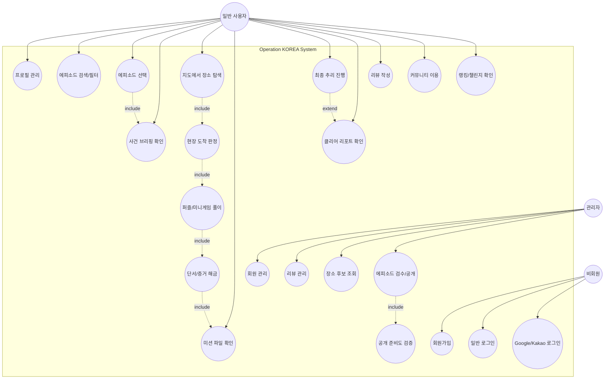

# Use-Case Diagram

## 1. Use-Case Diagram

## 2. Use-Case 명세

| Use Case | Actor | 선행 조건 | 기본 흐름 | 예외/대안 |
| --- | --- | --- | --- | --- |
| 로그인 | 비회원 | 계정 또는 OAuth 계정 존재 | 인증 → JWT 발급 → 권역 지도 이동 | 비활성/오류 계정은 실패 |
| 에피소드 플레이 | 사용자 | 로그인, 공개 에피소드 존재 | 목록 → 브리핑 → 지도 → 도착 → 퍼즐 → 단서 해금 | GPS 실패 시 안내 |
| 최종 추리 | 사용자 | 조사 미션 완료 | 최종 장소 도착 → 질문/가설 → 정답 제출 | 오답 시 시간 패널티 |
| 에피소드 공개 | 관리자 | DRAFT 존재 | readiness 확인 → 공개 전환 | 필수 데이터 누락 시 차단 |

