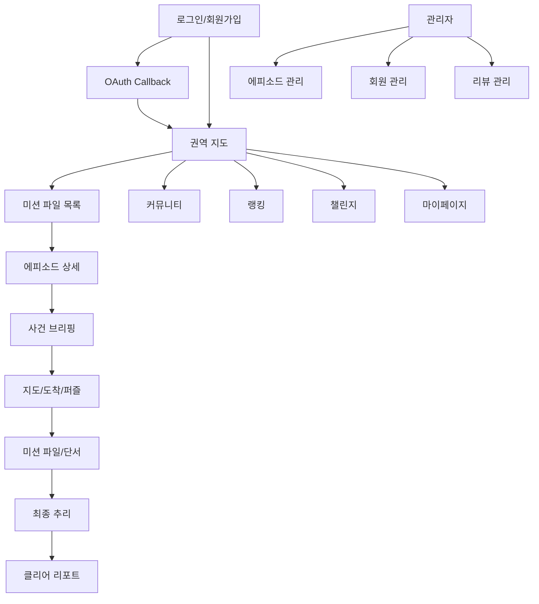

# 화면 설계서

상세 화면 흐름과 와이어프레임은 `04_SCREEN_DESIGN.md`에도 함께 관리한다.

## 1. 정보 구조



## 2. 주요 화면 와이어프레임

### 인트로

```text
+------------------------------------+
| OPERATION: KOREA                   |
| [이메일] [비밀번호]                |
| [로그인]                           |
| [Google 로그인] [Kakao 로그인]     |
| 회원가입 입력 영역                 |
+------------------------------------+
```

### 에피소드 목록

```text
+------------------------------------+
| CASE FILES                         |
| [검색어] [지역] [시대] [검색]     |
| [CASE 카드] 제목/난이도/관심       |
| [CASE 카드] 제목/난이도/관심       |
| 페이지네이션                       |
+------------------------------------+
```

### 지도 플레이

```text
+------------------------------------+
| FIELD MAP              [단서 보드] |
| 상태 메시지                         |
| +--------------------------------+ |
| | Kakao Map                      | |
| | [S] [I] [I] [F] 마커           | |
| | 장소 팝업 / 퍼즐 팝업          | |
| +--------------------------------+ |
+------------------------------------+
```

### 퍼즐/미니게임

```text
+------------------------------------+
| 미션 타입 / 난이도          [닫기] |
| 안내 문구                           |
| 문제 또는 미니게임 영역             |
| [미션 결과 제출] 또는 [정답 제출]  |
| 결과 메시지                         |
+------------------------------------+
```

### 관리자 에피소드

```text
+------------------------------------+
| ADMIN EPISODES                     |
| 좌측: 에피소드 목록                |
| 우측: 기본정보/장소/퍼즐/증거      |
| [검증] [공개 전환] |
+------------------------------------+
```

## 3. 입력/검증 규칙

| 화면 | 입력 | 검증 |
| --- | --- | --- |
| 로그인 | 이메일, 비밀번호, OAuth | 계정 상태, 토큰 유효성 |
| 목록 | keyword, areaCode, era | 빈 값 허용, 공개 에피소드만 조회 |
| 퍼즐 | 정답 또는 미니게임 proof | 서버 정답 비교 |
| 최종 추리 | 질문, 가설, 최종 정답 | 질문 수 제한, 오답 패널티 |
| 관리자 검증 | 권역, 장소 후보 | publish readiness 검증 |

